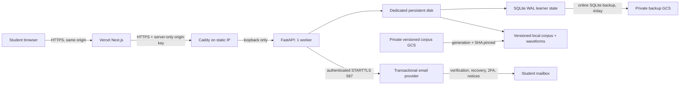

# Durable Vercel + GCP deployment

This package deploys the current application architecture without a tunnel:
the Next.js frontend runs on Vercel, and one FastAPI worker runs behind Caddy on
one GCE VM. A dedicated persistent disk holds the immutable release corpus and
the SQLite/WAL learner database. It is deliberately a single-writer design.

Nothing in this directory has been applied to a cloud account. Terraform starts
with `provision_instance = false`, creates no secret versions, and uploads no
image, corpus, learner data, or raw research dataset.



## Security and durability boundaries

- Public firewall ingress is TCP 80/443 only. TCP 22 accepts only Google's IAP
  tunnel range; OS Login and a short explicit operator list control access.
- Caddy terminates public HTTPS. Uvicorn binds `127.0.0.1`, trusts only Caddy,
  and starts exactly one worker. Terraform-controlled Docker CPU, memory
  reservation, hard-memory, and swap ceilings leave capacity for host recovery
  services.
- Vercel injects `ECG_ORIGIN_SHARED_SECRET` in its server-only proxy. The
  backend rejects direct learner API calls; `/livez`, `/health`, and `/readyz`
  remain available to probes.
- The VM service account can read the one configured corpus object, create and
  read objects only under the backup prefix, pull only from the app repository,
  and read only the app's Secret Manager containers. SMTP host, sender,
  monitored Reply-To, public URL, port, and username are non-secret metadata;
  an SMTP password is fetched only from its dedicated Secret Manager container.
  The VM cannot delete or overwrite backups.
- The host rejects IPv4 and IPv6 metadata-server traffic from container UID
  10001 before every backend start and reconciles those rules every minute.
  Root host operations retain metadata/gcloud access, while a compromised app
  cannot mint the VM service-account token through host networking.
- Corpus hydration pins both GCS object generation and SHA-256, checks archive
  paths, validates SQLite integrity/counts and waveform counts, then promotes a
  versioned directory atomically.
- Learner-state backups use Python's SQLite online backup API, validate the
  snapshot, gzip it, and upload a uniquely named object plus SHA-256 sidecar.
  A separate daily persistent-disk snapshot is defense in depth.
- Root maintenance locks, temporary files, backup marker, and corruption
  quarantine live in root-owned `/srv/ecg-data/ops`, never beside the
  app-writable database. The container receives that directory read-only and
  can only read the group-scoped freshness marker.

The release corpus bucket is for approved learner-facing artifacts. Never put
raw MIMIC data or another credentialed research source into it.

## Prerequisites

- A billed GCP project and a public DNS name such as `api.ecg.example.org`.
- Terraform 1.6+ (or Docker for the commands below), `gcloud`, Docker, `jq`,
  SQLite, GNU tar, and zstd on the release workstation/Cloud Shell.
- Infrastructure-operator permissions to enable the declared APIs and create
  the reviewed resources, plus Cloud Billing budget create/update permission on
  the selected billing account.
- A Vercel Pro (or higher) project whose root directory is `frontend`. Hobby
  is documented for personal, non-commercial use; this production launch also
  requires fixed-window WAF rate limiting and spend controls. Confirm current
  eligibility and price on the [Vercel plan page](https://vercel.com/pricing)
  before approval.
- A provider-approved transactional-email account, a sender domain the project
  owns and can authenticate for a polished launch, and a monitored support
  mailbox. The shared `ecg-tool.vercel.app` hostname is not an owned sender
  domain. See `docs/AUTH_EMAIL_PROVIDER_DECISION.md` before any signup, domain
  purchase, DNS change, secret version, or paid-plan activation.
- An approved, complete corpus directory containing `manifest.json`,
  `corpus.db`, and `waveforms/`.

Use a dedicated application project, not the raw ECG research-data project.
`roles/compute.osAdminLogin` is necessarily project-scoped and would otherwise
apply to unrelated OS Login VMs in a shared project.

Configure a remote encrypted Terraform backend under the institution's normal
state policy. The package deliberately declares an empty GCS backend, so plain
`terraform init` cannot silently fall back to local state. Separately create a
dedicated state bucket only after cost approval, with uniform access, public
access prevention, versioning, retention, and narrowly scoped operator IAM;
then copy `terraform/backend.hcl.example` to the ignored `backend.hcl`.

Resolve and record a concrete Debian image immediately before the reviewed VM
plan. The module rejects mutable family aliases:

```bash
gcloud compute images describe-from-family debian-12 \
  --project=debian-cloud --format='value(name)'
```

Set `source_image` to
`projects/debian-cloud/global/images/RETURNED_IMAGE_NAME`.

## Phase 1: foundation only

Copy `terraform/terraform.tfvars.example` to the ignored
`terraform/terraform.tfvars`. Set unique bucket names and leave:

```hcl
provision_instance = false
```

**Cost approval is a separate hard gate.** Even without a VM, the persistent
disk, reserved static address, and buckets can incur charges. After a named
operator reviews the plan, lifecycle, and teardown path, set the billing
account/monthly amount for the Terraform-managed project budget, record
auditable Vercel and LLM provider spend-limit references, and explicitly set
`billing_acknowledged = true`. Missing evidence blocks the foundation before
resource creation. GCP budgets alert but do not hard-cap spend; automatic
billing disablement is intentionally excluded because it can jeopardize
durable recovery resources.

Then initialize, validate, review, and apply only the foundation:

```bash
cd deploy/gcp/terraform
terraform init -backend-config=backend.hcl -input=false
terraform fmt -check -recursive
terraform validate
terraform plan -out=foundation.tfplan
terraform apply foundation.tfplan
```

This reserves the static IP and creates the protected disk, buckets, registry,
secret containers, network, and least-privilege identity. There is no VM yet.
The reserved unattached IP and 20 GiB disk can still incur charges during this
phase, so do not leave an unused foundation running indefinitely.

## Publish immutable prerequisites

Add generated auth/origin secret versions. Values never enter Terraform state:

```bash
bash ../scripts/add-secret-versions.sh \
  YOUR_PROJECT ecg-auth-rate-limit-secret ecg-origin-shared-secret
```

Set the provider-neutral `auth_email_*`/`auth_smtp_*` Terraform values before
the foundation apply, including a monitored `auth_email_reply_to`. SMTP
authentication is mandatory for an enabled production VM, so Terraform creates
the dedicated password container in `smtp` mode. Add the provider-issued SMTP password from
stdin only after an operator has reviewed the provider, sender domain, quota,
privacy terms, and possible cost:

```bash
gcloud secrets versions add ecg-auth-smtp-password \
  --project YOUR_PROJECT --data-file=-
# Paste the password, then send EOF. Do not put it in tfvars or shell history.
```

No provider account, sender domain, paid tier, or secret version is created by
this repository. Until those external choices are complete, leave
`provision_instance = false`; an enabled backend fails its Terraform/installer/
application readiness gates if verified-account mail is unavailable.

The production example intentionally enables the live grounded tutor. Add its
API key from stdin after Terraform creates the optional secret container:

```bash
gcloud secrets versions add ecg-llm-api-key \
  --project YOUR_PROJECT --data-file=-
```

Set `llm_model` to a model actually approved for that account. The committed
tfvars example uses `openai-compatible`, `llm_required = true`, bounded request
size/time/token settings, and per-learner/IP/global reservation limits. The
fallback tutor remains available after quota exhaustion, but a missing live
provider configuration makes production readiness fail.

Also configure a provider-side project/monthly spend limit before launch. The
application's 128 KiB serialized request cap, 1,200-token completion cap, and
500-call global daily reservation limit bound individual/runtime behavior, but
they do not replace the provider account's independent billing control.

Build and push the backend. Record the returned digest URI, not its tag:

```bash
bash ../scripts/build-backend-image.sh \
  YOUR_PROJECT us-east1 ecg-tool-backend
```

The Docker build installs `backend/requirements-prod.txt` with
`--require-hashes`; dependency changes require an intentional lock refresh and
produce a new image digest.

GitHub CI in `.github/workflows/ci.yml` runs the complete backend tests,
frontend lint/type-check/hosted build, Terraform format/validate, shell syntax
and ShellCheck, an executable SQLite backup/restore regression, the complete
Playwright student-flow suite against the checked real-PTB CI corpus, a
non-root/read-only Docker smoke test, and a secret scan. The
manual `publish-backend.yml` workflow intentionally fails unless it is run from
a protected `main` or `release/*` branch whose exact commit has successful CI.
Configure a reviewer-protected `backend-release` GitHub environment and the
non-secret repository variables `GCP_WORKLOAD_IDENTITY_PROVIDER`,
`GCP_DEPLOY_SERVICE_ACCOUNT`, `GCP_PROJECT_ID`, `GCP_REGION`, and
`GCP_ARTIFACT_REPOSITORY`; do not store either Workload Identity resource name
as a secret. With `enable_github_actions_publisher = true`, Terraform outputs
the first two values. Its provider admits only `dhruvpatel19/ecg-tool` tokens
from `main` or `release/*`, and the dedicated service account can write only the
`ecg-tool-backend` Artifact Registry repository. See
`terraform/README.md#optional-keyless-github-image-publisher` for the reviewed
setup commands. The workflow publishes a unique tag and reports the verified
immutable digest; it does not apply Terraform or change the running VM.

Clean GitHub runners verify the authored Clinical bank against the committed,
checksum-pinned 106-tracing **real PTB-derived** test corpus documented in
`backend/tests/assets/PTB_CI_CORPUS_ATTRIBUTION.md`; it contains no synthetic
learner ECGs. The fixture contains 103 encounter tracings plus three
de-identified longitudinal priors. This small source-test dependency does not
relax or replace the 22,497-case production corpus audit below.

Package the complete corpus and opt in to upload it:

```bash
bash ../scripts/package-corpus.sh \
  /absolute/path/to/ecg_corpus 2026-07-13 /tmp/ecg-release \
  gs://YOUR_CORPUS_BUCKET/releases --upload
```

Packaging fails closed unless the release audit can traverse every database
case to its canonical NPY waveform with the exact expected path, shape, and
dtype and finds no missing or extra waveforms. It also verifies source-policy
counts and the 103-case Clinical bank harness. The generated
`release-audit.json` is included in the archive, pinned by the manifest, and
reverified during hydration before the release can become active.

Record the printed SHA-256 and the exact object generation:

```bash
gcloud storage objects describe \
  gs://YOUR_CORPUS_BUCKET/releases/ecg-corpus-2026-07-13.tar.zst \
  --format='value(generation)'
```

Create the backend DNS A record using `terraform output -raw static_ip`. Wait
for it to resolve before starting the VM so Caddy can obtain its certificate.

## Phase 2: deliberately create the VM

Fill these values in the ignored tfvars file:

```hcl
backend_image           = "us-east1-docker.pkg.dev/PROJECT/ecg-tool-backend/ecg-backend@sha256:..."
source_image            = "projects/debian-cloud/global/images/debian-12-bookworm-vYYYYMMDD"
corpus_object_name       = "releases/ecg-corpus-2026-07-13.tar.zst"
corpus_object_generation = "1234567890123456"
corpus_archive_sha256    = "64-lowercase-hex-characters"
health_check_host         = "api.ecg.example.org"
health_check_use_ssl      = true
health_check_validate_ssl = true
acme_email                = "ops@example.org"
auth_email_delivery_mode  = "smtp"
auth_email_from_address   = "TRACE <no-reply@example.org>"
auth_email_reply_to       = "TRACE support <support@example.org>"
auth_public_app_url       = "https://ecg.example.org"
auth_smtp_host            = "smtp.example.org"
auth_smtp_port            = 587
auth_smtp_username        = "provider-account"
auth_smtp_password_secret_id = "ecg-auth-smtp-password"
auth_smtp_starttls        = true
auth_smtp_timeout_seconds = 10
llm_provider              = "openai-compatible"
llm_required              = true
llm_model                 = "YOUR_APPROVED_MODEL"
llm_base_url              = "https://api.openai.com/v1"
enable_llm_secret         = true
authenticated_retention_policy_acknowledged = true
authenticated_retention_policy_reference    = "POLICY-OR-DOCUMENTATION-URL"
provision_instance        = true
```

The two authenticated-retention inputs are an external governance gate. Keep
them `false`/empty until product/legal owners approve a policy covering live
records, backup expiry, restore suppression, legal holds, and institutional
deprovisioning. The reference is a non-secret policy ID or documentation URL.
Setting the boolean does not create a policy or configure a retention duration;
production Terraform and backend readiness both fail closed unless the approved
pair is supplied.

Set `allow_initial_disk_format = true` only for the first boot of the new blank
Terraform-created data disk. After that boot mounts the disk successfully,
immediately change it back to `false` and apply the metadata-only update. The
installer always refuses a disk with an existing signature/partition layout or
an unexpected mounted UUID.

Run `terraform plan` again and inspect it before applying. The startup shim
stages the reviewed scripts/unit/Caddy assets embedded in Terraform metadata;
it never clones a repository or downloads executable deployment code. The host
installer then:

1. formats only an unformatted attached disk and mounts it;
2. fetches root-only auth/origin, required SMTP-password, and tutor secrets from
   Secret Manager;
3. hydrates and validates the exact corpus artifact;
4. pulls the digest-pinned backend image;
5. installs Caddy, the single-worker service, and the backup timer; and
6. creates the learner schema, completes the mandatory initial online backup,
   and then requires fresh backup/corpus/database/auth-email/live-tutor checks
   for durable readiness.

Inspect first boot through serial/startup logs or IAP. A successful boot makes
`https://HOST/readyz` return HTTP 200 with `"ok": true`.

## Connect Vercel

Set these as encrypted Vercel server-runtime variables for **Production only**:

```dotenv
ECG_BACKEND_API_BASE=https://api.ecg.example.org
ECG_ORIGIN_SHARED_SECRET=<same Secret Manager origin value>
```

Do not set `NEXT_PUBLIC_API_BASE` and never prefix the origin key with
`NEXT_PUBLIC_`. Browser code continues to call `/api/backend`; only the Vercel
route handler sees the backend URL/key. The hosted prebuild gate fails if the
HTTPS URL or a 32+ character origin key is missing.

Do not give arbitrary Preview branches the production backend URL or origin
key: a preview could mutate real learner state. Either configure Preview with a
separate staging backend/secret or leave the variables absent so the deployment
gate intentionally fails.

Do not add `AUTH_EMAIL_*` or `AUTH_SMTP_*` values to Vercel. Email is sent by the
GCP backend, and moving credentials into Vercel would create a second unmanaged
secret copy without improving delivery.

### Mandatory authentication edge throttles

Before making the Vercel deployment public, publish both project-level
Firewall rules below. Login and registration also have durable pre-hash
pair/IP/global limits; both the edge and application boundaries are required.
Vercel's fixed-window rate-limiting template is currently documented for Pro
and Enterprise projects; inability to configure and publish these rules blocks
production rather than weakening this gate.

The application admits at most **8** password-hash attempts for one
`(source IP, normalized username)` pair, **120** for one source IP, and **600**
deployment-wide in each 15-minute window. The next request at an exhausted
bucket receives the same generic invalid-credentials body, HTTP 429, and
`Retry-After: 900` without a user lookup or PBKDF2 calculation. Bucket keys are
domain-separated HMACs: raw usernames and addresses are not stored. A verified
login clears only its pair bucket; aggregate IP/global reservations remain.
Requests already rejected by a narrower bucket do not consume a broader
allowance. These values are code-reviewed CPU-safety limits, not substitutes
for the shorter edge window below.

Registration is independently gated before validation or password hashing. It
admits at most **8** attempts for one `(source IP, normalized username)` pair,
**200** for one source IP, and **600** deployment-wide in each 15-minute
window. All admitted registration attempts reserve capacity, including a
successful create; success does not clear a bucket. Exhaustion returns HTTP
429 and `Retry-After: 900`, and a request already rejected by its pair bucket
does not consume IP/global capacity. Registration uses its own domain-separated
HMAC namespace, so its counters neither store identifiers nor collide with the
login counters.

- Login rule name: `Auth login PBKDF protection`.
- Conditions, combined with **AND**: Request Method equals `POST`; Request Path
  equals `/api/backend/auth/login`.
- Action: **Rate Limit**, **Fixed Window**, 60-second window, 10-request limit,
  counting key **IP Address**, follow-up action **429**.
- Registration rule name: `Auth registration write protection`.
- Conditions, combined with **AND**: Request Method equals `POST`; Request Path
  equals `/api/backend/auth/register`.
- Action: **Rate Limit**, **Fixed Window**, 60-second window, 5-request limit,
  counting key **IP Address**, follow-up action **429**.

These rules apply Vercel's documented fixed-window pattern for
authentication-abuse protection; registration uses the lower baseline because
account creation is a rare, state-writing operation. Test each condition in Log
mode against an isolated preview, then switch it to the
enforcing 429 action and **Publish** it before launch; a saved draft is not a
control. Confirm both rules in the Firewall traffic view. From one test IP,
exercise eleven dummy login attempts and six invalid dummy registration
attempts; the eleventh login and sixth registration request must be stopped at
the edge. Review Vercel's rate-limiting pricing as part of the deployment budget.
See [Vercel's authentication-abuse recipe](https://vercel.com/kb/guide/limit-abuse-with-rate-limiting)
and [WAF rate-limit configuration](https://vercel.com/docs/vercel-firewall/vercel-waf/rate-limiting).

These defaults can reject legitimate simultaneous authentication when an
entire class shares one campus/NAT address. For a scheduled class, use reviewed
temporary classroom profiles of **60 requests per 60 seconds per IP** for both
exact routes, observe the Firewall and application throttle counters, then
restore login to 10/60 and registration to 5/60 after the enrollment/login
window. Do not disable either rule or key it from a browser-supplied header. If
the expected class is larger than 60 learners behind one address, load-test and
approve a capacity-specific window first; the application global pre-hash
ceilings remain the final CPU-safety boundary. The temporary edge profile does
not override the application's 120-login and 200-registration per-IP ceilings
inside 15 minutes. Cohorts that can exceed either ceiling need staggered
enrollment/login or a separately reviewed, tested application release—not just
a looser Firewall rule.

Authentication-edge release evidence (all required):

- [ ] Both published Firewall rule versions recorded in the release notes.
- [ ] Matching traffic visible for both exact POST paths.
- [ ] Edge-generated 429 verified independently for login and registration.
- [ ] Classroom/NAT profiles, if used, have an owner and scheduled restoration
  to login 10/60 and registration 5/60.

After Vercel deploys, test login and one write-producing learning interaction,
then confirm it survives a page refresh. The read-only infrastructure check is:

```bash
gcloud secrets versions access latest --secret ecg-origin-shared-secret \
  --project YOUR_PROJECT \
  | bash deploy/gcp/scripts/validate-deployment.sh https://api.ecg.example.org
```

Before the provider-backed smoke, exercise all templates and the actual SMTP
wire path locally without credentials or delivery cost:

```bash
python scripts/smoke_auth_email_local.py
```

On the VM, inspect configuration-only mail readiness without printing any
address, host, URL, credential, provider response, or message content:

```bash
sudo docker exec ecg-backend python -m app.auth_mailer_cli
```

This command does not contact the provider. A release owner must still complete
real verification/reset/email-change/2FA/security-notice delivery tests and
confirm SPF, DKIM, DMARC, bounce/suppression, and quota behavior.

Validate the production frontend's per-request nonce CSP, HSTS, clickjacking
policy, and the Foundations same-origin embedding exception:

```bash
bash deploy/gcp/scripts/validate-vercel-frontend.sh https://student.ecg.example.org
```

Then run one intentional live-tutor smoke through the deployed student UI and
confirm it returns a substantive answer. The companion protected check performs
a real provider call and consumes a guest quota reservation; it is separate
from readiness so probes never spend tokens:

```bash
gcloud secrets versions access latest --secret ecg-origin-shared-secret \
  --project YOUR_PROJECT \
  | bash deploy/gcp/scripts/validate-live-tutor.sh https://api.ecg.example.org
```

## Health, operations, and recovery

- `/health` and `/livez` are process liveness checks.
- `/readyz` returns 503 unless the complete real corpus is mounted/queryable,
  its pinned exhaustive release audit matches, the 100+ distinct-real-ECG
  Clinical bank remains fully harness-valid,
  the learner SQLite database can take a write lock, the state filesystem can
  create and `fsync` a file, at least 2 GiB remains free by default, the last
  successful online backup is fresh, and the required live tutor key/provider
  is configured. The service unit gates only on liveness during bootstrap;
  public readiness remains closed until the installer finishes the mandatory
  initial backup.
- The backend systemd unit gates process startup on `/livez`. The installer,
  release, and restore workflows gate completion on `/readyz`; Caddy uses full
  readiness for active upstream health, and Cloud Monitoring alerts after
  sustained readiness failure.
- Backups run at 00:17, 06:17, 12:17, and 18:17 UTC with randomized delay.
- With a healthy host/timer, the scheduled recovery-point target is no more
  than roughly 6h15 plus backup duration (six-hour cadence with up to 15 minutes
  randomized delay). Readiness turns red after 14 hours without a success;
  that tolerance is not the RPO. Online backups are retained 90 days by
  default. Daily crash-consistent disk snapshots retain 14 days.

IAP-only administration:

```bash
terraform -chdir=deploy/gcp/terraform output -raw iap_ssh_command
gcloud compute ssh INSTANCE --zone ZONE --tunnel-through-iap
```

Useful checks on the VM:

```bash
sudo systemctl status ecg-backend caddy ecg-sqlite-backup.timer
sudo journalctl -u ecg-backend -u caddy --since '30 minutes ago'
sudo systemctl start ecg-sqlite-backup.service
sudo systemctl start ecg-metadata-firewall.service
sudo iptables -C OUTPUT -d 169.254.169.254/32 -m owner --uid-owner 10001 -j REJECT
sudo ip6tables -C OUTPUT -d fd20:ce::254/128 -m owner --uid-owner 10001 -j REJECT
sudo iptables -C OUTPUT -d 169.254.169.254/32 -p udp --dport 53 -m owner --uid-owner 10001 -j ACCEPT
sudo iptables -C OUTPUT -d 169.254.169.254/32 -p tcp --dport 53 -m owner --uid-owner 10001 -j ACCEPT
```

If a transient registry/Secret Manager/GCS dependency outlasts the bounded
bootstrap retries, rerun the reviewed installer rather than rebuilding the VM:

```bash
sudo systemctl reset-failed ecg-backend.service
sudo /bin/bash /opt/ecg-tool/deploy/gcp/scripts/install-host.sh \
  --config /etc/ecg/deployment.env
```

Restore requires an explicit object and its SHA-256; the script takes a fresh
remote backup, stops the writer, validates/installs the candidate atomically,
and rolls back if readiness fails:

```bash
sudo /bin/bash /usr/local/lib/ecg-deploy/restore-sqlite.sh \
  gs://BACKUP_BUCKET/backups/ecg-tool/YYYY/MM/DD/FILE.sqlite3.gz \
  EXPECTED_SHA256
```

That safe path intentionally refuses to proceed if the source database cannot
be backed up. For confirmed source corruption, an operator must invoke the
explicit break-glass mode after recording the incident and selected recovery
point:

```bash
sudo /bin/bash /usr/local/lib/ecg-deploy/restore-sqlite.sh \
  --corrupt-source-break-glass \
  gs://BACKUP_BUCKET/backups/ecg-tool/YYYY/MM/DD/FILE.sqlite3.gz \
  EXPECTED_SHA256
```

Break-glass stops the writer first, moves the raw database/WAL/SHM into a
root-only timestamped `ops/quarantine/` directory without opening them,
installs and validates the selected backup, and requires a new successful
online backup before readiness reopens. If the candidate fails, the service
stays stopped and both source and failed-candidate evidence remain quarantined.
Copy needed forensic evidence to an approved restricted location, then remove
the local quarantine only under the incident-retention policy.

Roll out a new backend image only by digest. Before changing `backend_image`,
put the currently deployed digest in `artifact_recovery_image_digests`; the
registry keep policy then protects both the active declaration and intentional
recovery artifact. Apply the metadata change, then run the rollout script. It
refuses a digest that is not already the durable Terraform declaration.

The script pulls first, takes the single writer briefly out of service, and
must complete a verified append-only SQLite online-backup snapshot before the
candidate can touch learner data. If candidate readiness fails, it restores
both that exact recovery point and the previous image. The learner database has
an explicit schema ledger/`user_version`; a binary encountering a newer,
unsupported schema fails before mutation:

```bash
sudo /bin/bash /usr/local/lib/ecg-deploy/install-release.sh \
  REGION-docker.pkg.dev/PROJECT/REPOSITORY/ecg-backend@sha256:...
```

If readiness rolls back, immediately restore the previous digest in tfvars and
apply it too; otherwise the failed digest remains the next-boot desired state.
This ordering prevents a reboot from silently restoring an old manually chosen
image or retrying an already rejected one.

Terraform metadata updates do not run the startup installer on a live VM.
Changes to the embedded host assets, corpus generation/SHA, secret IDs, tutor
configuration, or retention-related runtime settings require the reviewed
Terraform apply followed by an in-place startup reconciliation:

```bash
sudo google_metadata_script_runner startup
```

A controlled reboot is the recovery alternative and runs the same startup
metadata path. Both re-stage the exact asset bundle and idempotently reconcile
the host. Validate backup freshness and a student flow afterward.

Test restore on a non-production copy regularly; creating backups is not proof
that recovery works. Secret rotation also needs an operational rehearsal. The
origin key currently accepts one value, so rotate the backend and Vercel during
a brief coordinated maintenance window.

## Hard scale-out gate

Do **not** add Uvicorn workers, a second VM, a managed instance group, Cloud Run
replicas, or a second writer against this disk. SQLite/WAL and the local
waveform store are intentionally single-node.

Before any replica/HA work, all of these gates must be complete:

1. Implement and test a managed Postgres adapter for learner, auth, Training,
   Rapid, and Clinical stores, including migrations, transactional idempotency,
   row-lock semantics, connection pooling, backups, and point-in-time recovery.
2. Implement the existing `WaveformStore` boundary against a private object
   store with immutable object keys, bounded caching, integrity metadata, and
   equivalent source-policy enforcement.
3. Remove all local-disk coordination assumptions; add distributed-safe session
   deadlines, uniqueness constraints, and concurrency/load tests.
4. Migrate and reconcile the SQLite data, run dual-read verification, execute a
   rollback drill, and demonstrate that mastery/session ownership is unchanged.
5. Only then introduce replicas behind a managed load balancer and replace the
   single-node deployment runbook.

Until those gates pass, this package favors recoverable simplicity over false
high availability.

## Retention and rollback bounds

- Noncurrent generations of a corpus object expire after 90 days. The exact
  live Terraform-pinned object is never age-deleted automatically because its
  loss would break disk-loss recovery. Quarterly, inventory uniquely named live
  release objects and delete only those whose name/generation differs from the
  current `corpus_object_name`/`corpus_object_generation` and is outside the
  approved rollback window. Hydration retains inactive local releases/artifacts
  for 30 days.
- Artifact Registry deletes images older than 90 days except for the ten most
  recent versions, the exact active `backend_image` digest, and every explicitly
  listed `artifact_recovery_image_digests` entry. The VM prunes unused local
  images after 30 days. Add the previous digest to the recovery list before
  switching the active declaration; remove it only after the reviewed rollback
  window closes.
- Learner backups use unique append-only names and expire after 90 days (plus
  configured soft-delete behavior). Recovery drills should select and verify a
  checksum sidecar inside that window.

These values are Terraform variables and should be changed only with a storage,
RPO, and rollback-cost review.

## Known production limits

- One zone and one application VM means restart/recovery, not zero-downtime HA.
- Terraform state backend and Monitoring notification channels are operator
  inputs; neither is guessed here.
- Secret payloads are materialized root-only on the VM and passed to the
  container environment. Root/Docker administrators can inspect them.
- Backend and Caddy logs are retained in the VM's local systemd journal; the
  package does not pretend legacy metadata installs Cloud Ops Agent. External
  readiness/firewall monitoring is centralized, but install a reviewed Ops
  Agent policy before relying on centralized application-log retention.
- The Vercel login and registration Firewall rules are external production
  controls and are not created by this Terraform package. Public launch is
  blocked until both published configurations and both 429 checks are recorded
  in the release notes.
- Scheduled persistent-disk snapshots are crash-consistent defense in depth
  (`guest_flush = false`) and do not have a dedicated failure alert in this
  package. The separately monitored SQLite online-backup freshness gate is the
  application-consistent recovery signal.
- Public DNS and ACME issuance must be working before the HTTPS readiness check
  can pass.
- `environment = "production"` is a hard gate: TLS certificate validation must
  be enabled and at least one reviewed Monitoring notification channel must be
  configured. Demo/staging may omit a channel only as an explicit non-production
  limitation.
- Application clinical-review and institutional privacy/compliance approval are
  separate release gates; infrastructure does not satisfy them automatically.

The controlled-demo defaults are an `e2-small` VM with 20 GiB standard boot and
data disks in `us-east1`. This preserves the full application behavior while
trading concurrency and latency headroom for lower fixed cost. The backend
container remains capped at 1.5 CPUs and 1536 MiB memory (1024 MiB soft
reservation, with swap capped at the same hard limit); Caddy, Docker, and
recovery jobs share the remaining host capacity. Change these values only with
a load/cost review, and move to `e2-medium`/`pd-balanced` if the thresholds below
are reached.
Scale the single VM vertically only after sustained CPU above 70%, memory above
75%, or measured request-latency pressure, with a cost review; vertical sizing
does not relax the no-replica gate.

Include VPC Flow Logs and firewall-rule logging ingestion in the GCP budget;
public traffic can make network telemetry a material Logging cost. Review log
volume/retention after the demo instead of assuming those controls are free.
