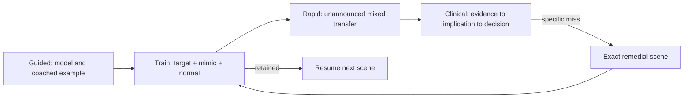

# TRACE guided curriculum — storyboard system v2

Status: superseded architecture record, July 2026. The source audit and learner-approved ten-module architecture now live in `docs/storyboards/CURRICULUM_ARCHITECTURE_RECOMMENDATION.md`; exact production copy lives in the `VERBATIM_M01_M03.md`, `VERBATIM_M04_M06.md`, and `VERBATIM_M07_M10.md` files. The scene principles below remain useful history, but this nine-module grouping is no longer the production authority.

## Iteration record

- **v0 — inherited product:** seven containers, a strong 13-scene Foundations iframe, and later lessons reduced to two or three bullets beside a case workspace.
- **v1 — architecture pass:** grouped the original 16 minimum topics into nine dependency-driven modules; separated guided learning, blocked practice, mixed testing, and clinical transfer; established the common scene grammar below.
- **v2 — learner/audit pass:** revised after direct browser testing and three independent learner-persona reviews. Changes: realistic durations; one primary action per scene; no mandatory animation gate; one scroll context; exact tangent waypoints; `skipped ≠ mastered`; multidimensional mastery; visible prior/next connections; and data locks for unsupported acute/serial/precision claims.
- **v3 — implementation/adversarial pass:** condensed the post-Foundations design into 65 native alpha scenes, then replayed it in a production browser and re-reviewed it through novice, clerkship and advanced personas. This pass fixed wrong/skip completion semantics, exact tangent return, general-vs-current-case classification, dominant-finding Rapid grading, focused Clinical handoffs, disclosed-answer mastery leakage, source-conflicted teaching exemplars, laptop overlap, and several measurement/click failures. The reviewers unanimously rated it suitable only for a moderated formative alpha—not a competency or efficacy pilot—because the shared native renderer still substitutes reveal-chain + MCQ for many specified waveform actions.

The detailed tables below remain the production content authority. The current native alpha bundles those story beats into 65 scenes (plus the 13-scene Foundations module); it does **not** imply that every animation, march, caliper, comparison, bounding task, explanation rubric, equivalent retry, or delayed transfer in these tables is implemented. A native scene cannot graduate from alpha until its specified action—not a prose surrogate—determines completion.

## Curriculum promise

The course teaches the learner to explain why a waveform looks the way it does, find and measure the evidence on a realistic tracing, distinguish the finding from its nearest mimics, synthesize the result, and use it appropriately in a clinical context. A label alone is never the end point.

The nine modules are:

1. Signal, Paper & the First Complete Read
2. Leads, Vectors, Axis & the Normal 12-Lead
3. Rate, Sinus Rhythm, Pauses & Ectopy
4. AV Conduction & Bradyarrhythmias
5. Ventricular Activation, Conduction, Pre-excitation & Pacing
6. Tachyarrhythmias: Narrow, Wide, Regular & Irregular
7. Repolarization, QT, Electrolytes & Drugs
8. Ischemia, Infarction, Territories & Mimics
9. Integrated Interpretation & Clinical Transfer

This ordering is deliberate. A learner sees rate and P–QRS relationships before AV block; QRS width and conduction before wide-complex tachycardia; secondary ST–T change before ischemia; and individual findings before time-pressured clinical synthesis.

## The reusable learning grammar

Each module is split into 8–15 minute resumable parts. A scene targets one primary action and normally takes 2–5 minutes.

1. **Retrieve:** a 60–90 second, low-stakes recall from a prerequisite module.
2. **Build:** manipulate a causal model—wavefront, vector, conduction path, timing ladder, or recovery curve.
3. **See:** predict, then reveal, on a canonical real tracing.
4. **Discriminate:** compare target, normal, and close mimic; do not teach an isolated prototype.
5. **Do:** point, measure, march, annotate, order, or compare on the calibrated viewer.
6. **Explain:** state the evidence and mechanism in the learner's own words; the tutor reasons back from the trace.
7. **Transfer:** solve a new, mixed tracing with less support.
8. **Connect:** show `Recall from…`, `This changes…`, `You will reuse this in…`, then offer a one-click matched Train drill.

Worked examples use predict-before-reveal. Guided examples fade from explicit attention cues to a silent sweep rail. A module exit requires independent performance on varied cases plus a delayed retrieval item; watching, skipping, or succeeding on one repeated beat cannot establish mastery.

## Screen and interaction design

The target is Storyline-like stateful interactivity implemented as a native web learning stage, not a slide deck.

- **Top bar:** module/part/scene, elapsed estimate, mastered/needs-review counts, bookmark, exit-with-resume.
- **Left rail:** collapsible part map. States are `not seen`, `viewed`, `attempted`, `needs review`, `mastered`, and `skipped`; only the last four are learner-visible labels and skipped never increases mastery.
- **Center stage:** one causal explanation or task, the ECG viewer, and the active response. It owns the only primary scroll.
- **Tutor dock:** collapsible and persistent. It never overlays the tracing or creates a second mandatory scroll path. On small screens it becomes a bottom sheet.
- **Context strip:** `Last time → Now → Next` plus a one-sentence bedside consequence.
- **Feedback layer:** appears adjacent to the evidence, not as a detached red/green toast. It supports replay, a smaller hint, and an equivalent retry.
- **Handoff drawer:** `Practice this`, `Test it mixed`, and `Use it in a case`, each carrying the exact concept and subskill.

Minimum core copy is 16 px; secondary copy is at least 14 px. All targets are at least 44×44 px. Color is redundant with text/pattern. Every drag has click-to-place and keyboard alternatives. Motion can pause, scrub, replay, skip, and respects reduced motion—including JavaScript typing and auto-scroll.

## AI learning contract

### State the tutor receives

Every turn carries a signed learning waypoint:

```text
moduleId, partId, sceneId, stepId, objectiveId, subskill,
scaffoldLevel, attemptHistory, hintHistory, learnerClaim,
caseId, visibleLeadSegments, viewerTimeWindow, selectedPoint,
annotations, pausedInteractionState, returnLabel
```

Case facts come only from the curated case packet and validated viewer geometry. General teaching comes from a versioned concept graph. Learner history comes from the competency model. The model is never allowed to silently merge those three sources.

### Tangent loop

1. Snapshot the exact waypoint and interaction state.
2. Classify the question as general concept, current-trace evidence, clinical-context teaching, or real-patient advice.
3. Answer the safe educational core directly. “This finding can have several causes and context matters” is better than refusing an ordinary learning question.
4. If useful, perform only validated, currently visible viewer actions.
5. State the relationship: `This connects to today's objective because…`.
6. Offer `Keep exploring` and `Return to [exact task]`.
7. Restore inputs, window, annotations, scaffold, and task state without replaying completed animation.

A tangent does not become “off topic” merely because its concept is not supported as a diagnosis on the current case. The tutor distinguishes “teach me generally” from “assert this finding on this tracing.” Real-patient interpretation or individualized treatment is bounded clearly.

### Tutor behavior by mode

| Mode | Before commitment | After commitment |
|---|---|---|
| Guided | proactive Socratic coach; may demonstrate or fade a hint | explains mechanism and sets an equivalent retry |
| Train | silent unless a bounded hint is requested | trace-grounded discriminator and targeted remediation |
| Rapid | silent | round debrief; no answer leakage between items |
| Clinical learn | may reveal staged information after an initial finding | critiques evidence → implication → decision chain |
| Clinical shift | silent | prioritization, safety, and communication debrief |

## Competency and adaptation model

Mastery is tracked per `concept × subskill`, not as one percentage:

- recognize;
- localize;
- measure;
- discriminate;
- explain mechanism;
- synthesize with other findings;
- apply in context;
- calibrate confidence.

The selector uses reliability, diversity, prior exposure, recency, hint level, response time, confidence, and near-mimic errors. If a learner struggles with RBBB, it gives a short blocked set, then interleaves LBBB, paced QRS, RVH, normal rSr′, and later delayed retrieval. Endless same-label repetition would create cueing, not competence.

Promotion requires success on at least two morphologies/task forms, one mixed transfer item, and one delayed item. High-confidence errors trigger faster remediation. Sparse concepts remain demonstration-only; they cannot earn a green mastery state.

## Cross-mode handoff contract

Every handoff carries origin, concept, subskill, support level, misconception, case provenance constraints, and exact return waypoint.



## ECG realism and data rules

- Default paper is 25 mm/s and 10 mm/mV with a visible calibration pulse; alternate speed/gain is explicitly labeled.
- Standard 3×4 printing is sequential. The tutor and grader must validate that a target time is visible in the named lead segment. An equivalent beat may be projected only with a disclosed, tested periodic rule.
- Square ECG paper stays square at every digital zoom. Time, amplitude, and lead mapping share one coordinate system.
- Raw sampling rate, filters, clipping, lead reversal, noise, and missing leads are surfaced when they affect interpretation.
- Manipulable synthetic waveforms are for causal experiments. Scored clinical recognition uses licensed, provenance-labeled, human-reviewed real ECGs or explicitly validated simulation.
- The current 100 Hz derivative is suitable for broad morphology but not a basis for overconfident fine fiducial precision. Rebuild from the original higher-rate source before precision measurement claims.
- PTB-XL is strongest for resting/chronic findings. Acute serial ischemia, telemetry rhythm evolution, and arrest rhythms remain locked until an appropriate licensed, validated corpus is ingested. STAFF-III is a candidate for controlled acute ischemia, not VT/VF or arrest.

---

# Module storyboards

## M1 — Signal, Paper & the First Complete Read

**Outcome:** describe a standard, readable 12-lead from calibration through a one-line systematic read without diagnosing pathology. **Duration:** 50–70 minutes, four resumable parts. **Prerequisite:** none. **Mode exit:** normal-vs-deviation Train deck and one untimed full read.

| Scene | Learning sequence and first principles | Stage / interaction | Checkpoint, clinical link, and connection |
|---|---|---|---|
| 1.0 Welcome and diagnostic | ECG = voltage over time; preview the complete sweep and let experienced learners test out by subskill. | Full-bleed heartbeat/tracing; choose `new`, `some exposure`, or `test me`. | No score. Sets support level; honest 50–70 min with 10–15 min chapters. |
| 1.1 One electrical wave | SA activation → atrial depolarization → AV delay → rapid His–Purkinje activation → ventricular recovery. | Scrubbable heart wavefront draws P, PR segment, QRS, ST, T. Predict which waveform appears next; label by tap/keyboard. | Explain why QRS is taller/narrower than P. Reused in every later mechanism. |
| 1.2 Paper is a ruler | Horizontal distance is time; vertical distance is voltage; speed and gain define meaning. | Count small/big boxes separately for time then voltage; resize a calibration pulse; optional calipers. | Correct two novel spans. Clinical link: measurements are invalid when calibration differs. |
| 1.3 Readable for what? | Artifact does not make every task equally impossible; distinguish rate-only, rhythm/interval, ST–T, and unusable. | Four real strips; classify assessable domains and box artifact; lead reversal as a preview. | Must correct errors on a second strip. Connects to M2 lead placement and every clinical case. |
| 1.4 Regularity before rate | R–R regularity chooses the method; estimates have tolerances. | March R waves; 300 rule on regular, 6-second count on irregular; spacing slider; read/verify machine value. | Estimate within case-appropriate tolerance and name method. Deepened in M3. |
| 1.5 Sinus as a relationship | Sinus is origin/P morphology and 1:1 P–QRS relationship, not a rate label. | Pair P with QRS, compare sinus brady/normal/tachy, identify upright-II/inverted-aVR pattern. | All criteria plus a transfer strip; wrong answers do not complete. Deepened in M3. |
| 1.6 PR and QRS | Boundaries first; PR represents atrial-to-ventricular conduction, QRS ventricular activation. | Learner marks onset/end, then drags calipers on two real median beats; compare with printed value. | Measure, state normal/long or narrow/wide, and say what remains unknown. Leads to M4/M5. |
| 1.7 ST, T, QT and normal template | Baseline/J point; recovery follows activation; QT changes with rate. | Tap baseline and J point; move ST once; assemble a normal beat; QT is previewed without correction formulas. | Restore the normal template and explain the reference line. Leads to M7/M8. |
| 1.8 Twelve views, one event | Leads are viewpoints, not twelve separate beats. | One beat fans into standard 3×4; scrub V1→V6 and see R/S transition; verify simultaneous rhythm strip. | Locate a lead and describe normal progression. Detailed vector model in M2. |
| 1.9 Axis glance | Axis is the net ventricular direction; lead I+aVF is a coarse quadrant screen. | Drag a vector; see limb-lead polarity; normal green sector plus explicit borderline lead-II refinement. | Identify normal vs clearly deviated, without causes. Full axis in M2. |
| 1.10 Modeled sweep | Calibration/quality → rate → rhythm → axis → intervals → QRS/morphology → ST–T → synthesis. | Two real ECGs; learner predicts one step before narrated highlight. | Active predictions required; tutor models uncertainty and `not assessable`. |
| 1.11 Guided sweep | Same sequence, prompts fade across normal and one describable deviation. | Structured rail; point/measure plus short meaning-graded explanation. | Critical misses require an equivalent retry; accepted synonyms and partial evidence are shown. |
| 1.12 Independent transfer | Use the sweep when the target is not announced. | First case keeps empty rail; second is blank read; tutor silent unless asked. | Component accuracy, evidence, confidence, and time reported separately. Handoff to M2 and Train. |

## M2 — Leads, Vectors, Axis & the Normal 12-Lead

**Outcome:** use lead geometry to predict polarity, localize findings, estimate axis, recognize normal R-wave progression, and suspect lead-placement error. **Duration:** 45–60 minutes. **Prerequisite:** M1. **Mode exit:** lead/axis localization drills.

| Scene | Learning sequence and first principles | Stage / interaction | Checkpoint, clinical link, and connection |
|---|---|---|---|
| 2.0 Retrieval and hook | Recall calibration, P/QRS/T, and the rough axis rule. Ask why the same beat looks different across leads. | 60-second normal 12-lead scavenger hunt. | Sets scaffold; clinical link: localization depends on viewpoint. |
| 2.1 Electrode is not lead | Electrodes sense; a lead is a voltage comparison with a positive viewing direction. | Move a positive electrode around a heart vector and watch polarity/amplitude change. | Predict up/down/isoelectric for three positions. |
| 2.2 Vector projection | Deflection magnitude is projection onto a lead axis; perpendicular vectors approach isoelectric. | Rotate wavefront and lead arrows; live dot-product graph without formula requirement. | Explain polarity and amplitude in plain language. Reused for axis, BBB, ST vectors. |
| 2.3 Limb leads | I, II, III and Einthoven geometry; patient-right versus screen-left orientation. | Place limb electrodes, build the triangle, fix one reversal. | Reconstruct I/II/III and identify a reversal clue. |
| 2.4 Augmented leads and hexaxial plane | aVR/aVL/aVF fill frontal viewpoints; neighboring axes form a circle. | Assemble the hexaxial wheel; click a lead to highlight its positive pole and opposite view. | Find neighboring/opposite leads. Prepares axis and reciprocal change. |
| 2.5 Chest leads and horizontal plane | V1–V6 move from right/anterior septum toward left/lateral ventricle. | Place precordial electrodes on a torso; rotate a horizontal activation vector. | Correct placement and lead-order check; link to BBB anchors. |
| 2.6 Contiguity and territories | Contiguous leads view adjacent tissue; territory is a localization hypothesis, not a diagnosis. | Paint inferior, lateral, septal/anterior regions; viewer highlights matching leads. | Select contiguous sets and an opposite lead. Reused in M8. |
| 2.7 Axis quadrants | Net QRS direction from I and aVF. | Drag vector, then classify unseen real ECGs by QRS polarity. | Two correct cases including clearly left/right deviation. |
| 2.8 Axis refinement | I positive/aVF negative needs lead II; continuous degrees convey borderline uncertainty. | Three-lead decision tree plus caliper-like vector estimate; compare machine axis. | State quadrant, approximate degrees, and confidence. Reused for fascicular block/chambers. |
| 2.9 R-wave progression | Septal-to-LV activation changes R/S ratio; transition is where R becomes larger than S. | Scrub V1→V6, mark transition, compare normal rotation variants. | Identify transition and avoid equating poor progression with infarction. |
| 2.10 Placement and normal variants | Limb reversal, high V1/V2 placement, body habitus, rotation, sex/age/athletic variation alter appearance. | Spot-the-error comparisons with a prior ECG; learner moves an electrode and watches the change. | Decide `variant`, `possible placement`, or `needs pathology module`; explain evidence. |
| 2.11 Transfer map | Combine lead geometry, axis, progression, and quality on a new tracing. | Annotate three leads, estimate axis, localize a neutral waveform feature, then give a concise read. | Independent transfer plus one delayed M1 measurement. Handoff to axis/lead Train. |

## M3 — Rate, Sinus Rhythm, Pauses & Ectopy

**Outcome:** analyze rhythm systematically, distinguish sinus variants, PAC/PVC/escape/artifact, and describe pauses and patterned ectopy. **Duration:** 45–55 minutes. **Prerequisites:** M1–M2. **Mode exit:** blocked target/mimic/normal rhythm drills, then mixed Rapid.

| Scene | Learning sequence and first principles | Stage / interaction | Checkpoint, clinical link, and connection |
|---|---|---|---|
| 3.0 Retrieval and rhythm ladder | Rate, regularity, atrial activity, P–QRS relationship, QRS width. | Build the five-question ladder from shuffled cards on a normal strip. | Correct order; stability is previewed, not inferred from ECG alone. |
| 3.1 Rate under real conditions | Regular, regularly irregular, and irregularly irregular require different sampling. | March R waves on real strips; calculate and compare machine value; identify when 10 seconds is misleading. | Numeric tolerance against grounded heart rate—not mere presence of a number. |
| 3.2 Sinus variants | SA-node origin persists in sinus brady/tach and respiratory sinus arrhythmia. | Rate slider changes R–R while P morphology/source stays fixed; compare physiologic context cards. | Distinguish source from rate and state limits of the ECG. |
| 3.3 Prematurity and origin | An early impulse changes timing; ventricular origin changes depolarization route and QRS width. | Move an ectopic focus and trigger time; watch P/QRS/timing change. | Predict `early/late`, P presence, width, and pause before reveal. |
| 3.4 PAC | Early abnormal P may hide in the T wave; QRS usually narrow unless aberrant. | Overlay/magnify T-to-P transition; mark premature P and reset pause. | Locate evidence on two morphologies; compare artifact. |
| 3.5 PVC | Premature wide complex without a preceding sinus P, followed often by a compensatory pause. | Pair pre/post R–R calipers; compare PVC, PAC with aberrancy, and paced beat. | Evidence chain required; avoid diagnosing origin from width alone. |
| 3.6 Pauses and escape | Pause may follow ectopy, failed impulse formation/conduction, or artifact; escape beats are late rescue beats. | Timeline with expected sinus ticks; place missing/early/late beats. | Classify pause mechanism only to supported specificity. Leads to AV block. |
| 3.7 Patterned ectopy | Bigeminy/trigeminy/couplets describe pattern; frequency on ten seconds is not burden. | Tag beat sequence and calculate observed frequency; separate pattern from clinical burden. | Correct descriptor plus uncertainty. |
| 3.8 Artifact mimic | Motion/tremor/electrode noise can simulate atrial or ventricular activity while underlying QRS marches through. | Fade artifact layer; learner marches true QRS and boxes noise. | Identify preserved rhythm through artifact. |
| 3.9 Mixed discrimination | Sinus arrhythmia, PAC, PVC, escape, and artifact. | Five short strips; forced evidence selection before label. | ≥4/5 plus an equivalent retry for any high-confidence miss. |
| 3.10 Transfer and clinical bridge | Palpitations/syncope require rhythm, rate, symptoms, and duration—not label alone. | Real 12-lead + short context; concise rhythm read, confidence, and next datum to seek. | Handoff to Train/Rapid; link to M4 conduction and M6 tachy. |

## M4 — AV Conduction & Bradyarrhythmias

**Outcome:** measure PR, distinguish graded AV-conduction patterns, recognize AV dissociation/escape rhythms, and connect bradycardia to perfusion and reversible causes without overcalling. **Duration:** 50–65 minutes. **Prerequisite:** M3. **Mode exit:** conduction-pattern drills and a bradycardia decision case.

| Scene | Learning sequence and first principles | Stage / interaction | Checkpoint, clinical link, and connection |
|---|---|---|---|
| 4.0 Retrieval and hook | Rebuild the P–QRS ladder and distinguish early ectopy from dropped conduction. | Two-strip contrast; march P and QRS separately. | Names evidence, not block label. |
| 4.1 AV node versus His–Purkinje | AV node delays; His–Purkinje rapidly distributes. Failure level affects PR/QRS patterns and risk but ECG localization can be uncertain. | Dual-pathway timing animation; alter nodal delay vs infranodal failure. | Predict PR and QRS consequences. |
| 4.2 Measure PR consistently | Same lead, clear onset, multiple beats; compare constant versus changing. | Mark boundaries on three beats, then march PR intervals. | Accurate mean/range and `constant/progressive/variable`. |
| 4.3 First-degree pattern | Every P conducts with prolonged, constant PR; it is a conduction finding, not a dropped beat. | Threshold slider and real case; compare with blocked PAC. | Evidence statement plus clinical context boundary. |
| 4.4 Wenckebach | Progressive PR change before a dropped QRS and grouped beating; mechanism visualized at AV node. | Ladder diagram synchronized to strip; learner orders cycles. | Identify cycle and explain pattern; real-case competency locked if corpus sparse. |
| 4.5 Mobitz II | Constant conducted PR with unexpected nonconducted P; distinguish from concealed ectopy and artifact. | March P waves through a dropped beat; compare QRS width/context. | Specific label only when evidence supports it. |
| 4.6 2:1 and high-grade uncertainty | With every other P blocked, PR progression may be unknowable; say what is seen and what cannot be classified. | Toggle hidden P markers; choose strongest defensible statement. | Rewards `2:1 AV block; level uncertain`, not forced subtype. |
| 4.7 Complete AV block | Atria and ventricles run independently; ventricular escape source affects QRS/rate. | Two independent metronomes; align P and QRS, then un-link them over a real strip. | Demonstrate AV dissociation across several beats. |
| 4.8 Escape rhythms | Junctional escape tends to be narrower/faster than ventricular escape, with important exceptions. | Move escape focus and compare P relation/QRS; no single-feature diagnosis. | Classify with confidence and caveat. |
| 4.9 Causes and context | Drugs, ischemia, hypoxia, electrolytes and intrinsic disease are hypotheses requiring context. Symptoms/perfusion determine urgency. | Cause–mechanism map; staged vitals/medication reveal. | Choose next information, not a treatment from ECG alone. |
| 4.10 Bradycardia with a pulse | Apply 2025 AHA symptom/perfusion screen, acquire 12-lead, and recognize escalation logic. | Branching ward case; first identify rhythm, then reveal perfusion, then choose action category. | Evidence → compromise → action chain; exact medication/device details remain governed content. |
| 4.11 Mixed transfer | First-degree, Wenckebach animation, Mobitz II, 2:1, complete block, blocked PAC. | Fading six-case ladder with one compare-prior item. | Independent pattern + uncertainty + confidence; handoff to M5 and Clinical. |

## M5 — Ventricular Activation, Conduction, Pre-excitation & Pacing

**Outcome:** reason from QRS duration/morphology through BBB, fascicular block, pre-excitation and pacing; recognize chamber/voltage clues as hypotheses; understand secondary ST–T changes. **Duration:** 65–80 minutes in five parts. **Prerequisites:** M2 and M4. **Mode exit:** morphology contrast deck and WCT preparation.

| Scene | Learning sequence and first principles | Stage / interaction | Checkpoint, clinical link, and connection |
|---|---|---|---|
| 5.0 Retrieval | Reuse vector projection, axis, PR, and QRS boundary skills. | Annotate V1/V6 and estimate axis on one normal ECG. | Adaptive branch to refresher if needed. |
| 5.1 Duration versus morphology | Width asks how long; morphology asks how activation traveled. One does not substitute for the other. | Caliper three QRS complexes, then sort same-width different-shape examples. | Must state both duration and morphology. |
| 5.2 Bundle activation model | Normal simultaneous activation versus delayed right or left ventricular completion. | Split-screen conduction tree and V1/V6 vectors; block a bundle and predict terminal forces. | Predict lead changes before reveal. |
| 5.3 RBBB | Terminal rightward/anterior forces: V1 rSR′-type patterns and broad terminal S in lateral leads, with variants. | V1/V6 synchronized magnifier; mark initial vs terminal QRS; compare normal rSr′ and RVH. | Complete vs incomplete uses width plus morphology; avoid mnemonic-only grading. |
| 5.4 LBBB | Delayed LV activation: broad/notched lateral R and predominantly negative V1; secondary discordant ST–T. | Reverse activation animation; compare LBBB, LVH, pacing. | Identify anchors and explain secondary repolarization. Prepares M8 caveats. |
| 5.5 Nonspecific and incomplete conduction | Wide QRS without full criteria should remain nonspecific; incomplete patterns require width context. | Confidence ladder across borderline morphologies. | Strongest defensible label and what is missing. |
| 5.6 Fascicular blocks | Loss of a fascicle redirects the frontal QRS vector; axis is causal evidence, not a memorized suffix. | Turn off anterior/posterior fascicle and rotate vector; inspect limb leads. | LAFB/LPFB pattern only after excluding alternatives. |
| 5.7 Combined conduction | Bifascicular patterns and alternating BBB matter; avoid casual `trifascicular` terminology from first-degree PR alone. | Assemble components, then critique machine statements. | Rank evidence and escalation context for syncope. |
| 5.8 Pre-excitation | An accessory pathway bypasses AV delay: short PR, delta wave, widened fused QRS. | Blend normal and accessory wavefront timing; drag pathway delay. | Identify all three features and distinguish BBB/pacing. |
| 5.9 Pacing | Spike timing, chamber, capture and sensing are separate questions; ventricular pacing alters QRS/ST–T. | Match spike→P/QRS, inspect capture, detect one sensing/capture problem in authored simulation. | Evidence statement; device-management decisions require reviewed cases. |
| 5.10 Chamber/vector clues | Atrial P morphology and ventricular voltage reflect electrical forces affected by anatomy, age, body habitus and lead placement. | Change wall mass/direction/distance; observe voltage and axis. | Explain why voltage alone is not anatomy. |
| 5.11 Atrial enlargement and LVH/RVH | Apply P/voltage criteria as clues, then seek corroboration; introduce strain as secondary ST–T pattern. | Caliper voltage/P duration; compare athlete, hypertension, COPD/body-habitus mimics. | Criterion + limitation + confidence. |
| 5.12 Poor R progression and low voltage | Descriptive patterns with broad differential; compare placement, rotation, prior infarct, body habitus, effusion hypotheses. | Compare current/prior and lead placement; choose next check. | Does not award infarction from progression alone. |
| 5.13 Morphology transfer | RBBB, LBBB, nonspecific IVCD, pacing, pre-excitation, LVH, normal variant. | Unannounced mixed 12-leads; localize decisive features and write synthesis. | Two morphologies + one mimic + delayed axis item. Handoff to M6/M7. |

## M6 — Tachyarrhythmias: Narrow, Wide, Regular & Irregular

**Outcome:** use stability, regularity, QRS width, atrial activity and AV relationship to reason through common tachyarrhythmias and safe action categories. **Duration:** 60–75 minutes. **Prerequisites:** M3 and M5. **Mode exit:** timed rhythm recognition and reviewed tachycardia cases.

| Scene | Learning sequence and first principles | Stage / interaction | Checkpoint, clinical link, and connection |
|---|---|---|---|
| 6.0 Stability before elegance | ECG label does not replace perfusion assessment; unstable features change the priority. | Same rhythm with two clinical contexts; triage before subtype. | Identify serious symptoms/signs without assuming causation. |
| 6.1 Mechanisms | Enhanced automaticity, triggered activity, and reentry predict onset, regularity, and response patterns. | Trigger a focus or reentry loop; watch onset/termination and atrial/ventricular activation. | Explain one observable consequence of each. |
| 6.2 Tachycardia matrix | Regular/irregular × narrow/wide is the initial organizer; then inspect P–QRS relationship. | Sort strips into a 2×2 matrix, then reveal candidate sets. | Correct matrix before specific names. |
| 6.3 Sinus versus focal atrial versus SVT | P morphology, rate/context, onset, and RP/PR relation distinguish; no single rate cutoff is definitive. | Compare onset strips and P-wave overlays; reveal history after ECG commitment. | Defend strongest label and alternative. |
| 6.4 AVNRT/AVRT concepts | Reentry circuit location affects visibility/timing of atrial activity; exact subtype may be indeterminate on surface ECG. | Animate circuits and retrograde P; RP slider. | Name regular narrow tachycardia when subtype evidence is absent. |
| 6.5 Flutter | Atrial circuit can conduct 2:1, variably, or regularly; ventricular rate may obscure flutter waves. | Change AV conduction ratio; subtract QRS/T to expose atrial activity. | Distinguish flutter from SVT and AF across ratios. |
| 6.6 Atrial fibrillation | Disorganized atrial activity, no consistent P waves, irregularly irregular ventricular response; artifact and frequent ectopy mimic it. | March R–R and P-wave search; compare artifact/PACs. | Rhythm plus rate and evidence; clinical bridge to stroke/rate context, not automatic treatment. |
| 6.7 Irregular narrow differential | AF, flutter with variable block, multifocal atrial tachycardia, ectopy and artifact. | Evidence-first elimination board; MAT remains demonstration-only if data sparse. | State discriminator and uncertainty. |
| 6.8 Wide-complex tachycardia | Ventricular origin versus SVT with aberrancy/pre-excitation; safety framing favors VT when uncertain in the appropriate context. | Reveal morphology/AV dissociation/capture-fusion clues progressively; compare baseline BBB. | Prioritize `wide regular tachycardia; VT concern` over unsupported certainty. |
| 6.9 Mono- versus polymorphic | Beat-to-beat axis/morphology change matters; distinguish polymorphic VT and artifact. | Overlay consecutive complexes and rotate vector; authored telemetry animation. | Pattern recognition plus signal-quality check. |
| 6.10 Torsades preview | Polymorphic VT in the setting of prolonged repolarization links rhythm to QT, drugs, and electrolytes. | QT-before-rhythm paired timeline; no unsupported PTB-XL competency claim. | Connects directly to M7. |
| 6.11 2025 tachycardia algorithm | Initial support, stability, width, regularity, and action categories; cardioversion/adenosine constraints require exact context. | Branching case with staged vitals and rhythm; learner chooses next category, then sees rationale. | Clinician-reviewed content required before scoring actions. |
| 6.12 Transfer | Untimed reasoning, then 20-second quick-look with one high-yield response—not a full typed sweep. | Mixed narrow/wide and stable/unstable cases; confidence captured. | Separate recognition, prioritization, and action scores. Handoff to M7/Clinical. |

## M7 — Repolarization, QT, Electrolytes & Drugs

**Outcome:** identify and measure ST–T/QT features, understand rate correction and depolarization confounding, recognize broad drug/electrolyte patterns, and perform a safe medication-QTc review. **Duration:** 55–70 minutes. **Prerequisite:** M5. **Mode exit:** QT measurement/calibration drills and medication-safety cases.

| Scene | Learning sequence and first principles | Stage / interaction | Checkpoint, clinical link, and connection |
|---|---|---|---|
| 7.0 Retrieval | Revisit J point, baseline, QT boundary, QRS width, and secondary discordance. | Mark neutral components on normal, RBBB, and LBBB beats. | One correct boundary per beat. |
| 7.1 Recovery vectors | ST/T reflect ventricular recovery; normal polarity follows activation with lead-specific exceptions. | Activation/recovery vector animation; reverse recovery sequence. | Predict T direction without `always upright` rule. |
| 7.2 Baseline and J point | TP baseline, PR displacement caveats, and stable reference selection. | Tap baseline/J in noisy and tachy beats; compare machine marker. | Select defensible reference and state uncertainty. |
| 7.3 Normal variation | Early repolarization, juvenile patterns and isolated variations require age/context/lead distribution. | Morph continuum with demographic/context cards; no pathology label from one feature. | `likely variant / concerning / insufficient data` with evidence. |
| 7.4 ST depression and T morphology | Horizontal/downsloping/upsloping ST, symmetric/deep/biphasic T, and distribution are descriptive features before etiology. | Drag tangent at J+60/80 ms; annotate shape/distribution. | Precise description; ischemia deferred to M8. |
| 7.5 Choose and measure QT | QRS onset to T end; avoid U-wave inclusion; use a clear lead and multiple beats. | Tangent method vs threshold method on real median beats; keyboard calipers. | Two measurements within tolerance and documented lead. |
| 7.6 Correct for rate | QT shortens with faster rate; Bazett and Fridericia behave differently at extremes. | Rate slider plots raw QT and two corrections; learner predicts divergence. | Choose/formula caveat and compare with machine. |
| 7.7 Interpret QTc cautiously | Thresholds vary by age/sex/context; markedly prolonged values carry higher risk, but QTc is not a binary diagnosis. | Risk continuum rather than one red line; repeat measurement and confidence. | State value, method, context, and uncertainty. Numeric policy requires clinician sign-off. |
| 7.8 Wide QRS/pacing confound | Longer depolarization lengthens QT without equivalent recovery prolongation; consider reviewed methods/JT where appropriate. | Split QRS and JT components; compare native and paced/BBB beats. | Identify when a simple QTc is misleading. |
| 7.9 Drugs | Risk is medication- and condition-specific; lists change and require licensed, current sources. | Medication reconciliation with CredibleMeds category lookup placeholder, interactions, dose/renal context. | Do not embed copyrighted drug list without license; choose verify/recheck action. |
| 7.10 Electrolytes | K/Ca/Mg patterns affect P/QRS/ST/T/QT but are not perfectly specific; labs and serial change matter. | Ion sliders on a teaching waveform, then real/simulated pattern comparison. | Pattern hypothesis plus next datum; no lab diagnosis from ECG alone. |
| 7.11 Pericarditis/early repolarization/ischemia preview | Distribution, PR changes, reciprocal patterns, morphology and clinical context discriminate imperfectly. | Three-way comparison with feature matrix hidden until commitment. | Select evidence and acknowledge overlap. Leads to M8. |
| 7.12 Medication-safety transfer | Baseline ECG, manual QTc, current drugs/electrolytes, prior ECG, and follow-up plan. | Staged ward case; learner measures before seeing machine number and chooses next information/action category. | Evidence chain reviewed; handoff to Train/Clinical. |

## M8 — Ischemia, Infarction, Territories & Mimics

**Outcome:** describe ischemic/infarction patterns, localize by contiguous/reciprocal leads, compare serials/priors, recognize common mimics, and escalate uncertainty appropriately. **Duration:** 70–90 minutes in parts. **Prerequisites:** M2, M5, M7. **Mode exit:** chronic/established real-case drills now; acute/serial drills only after validated ingest.

| Scene | Learning sequence and first principles | Stage / interaction | Checkpoint, clinical link, and connection |
|---|---|---|---|
| 8.0 Retrieval | Contiguous/opposite leads, J point, ST/T description, secondary repolarization and normal variants. | Mark territory and baseline on three prior-module examples. | Adaptive prerequisite repair. |
| 8.1 Injury-vector model | Regional current/vector changes create lead-dependent ST displacement; ECG is one part of ACS evaluation. | Place affected region on heart and watch primary/reciprocal vectors. | Predict lead distribution from region. |
| 8.2 Contiguous and reciprocal | Multiple anatomically related leads and reciprocal change strengthen a pattern; isolated change needs caution. | Paint leads on 12-lead map; paired lead magnifiers. | Identify contiguous set and reciprocal evidence. |
| 8.3 Thresholds and measurement | J-point thresholds depend on lead, sex/age/context and guideline; morphology/dynamics matter beyond millimeters. | Calibrated J-point measurement with policy card version. | Numeric criteria remain clinician-reviewed/versioned; learner shows method. |
| 8.4 Anterior/septal/lateral patterns | Coronary anatomy and lead territories overlap; localization is a working description. | Territory-to-lead animation and real established-pattern comparisons. | Localize and name missing/reciprocal evidence. |
| 8.5 Inferior and right ventricular extension | Inferior changes prompt reciprocal lateral review and context-specific right-sided leads. | Reconstruct V4R placement; compare inferior mimic. | Choose next lead/check, not automatic culprit artery. |
| 8.6 Posterior pattern | Anterior ST depression/tall R may be a mirror; posterior leads can clarify. | Mirror V1–V3 waveform and flip to V7–V9 teaching view. | Recognize posterior concern and request additional leads. |
| 8.7 ST depression/T inversion | Distribution, depth, morphology and dynamics guide ischemia concern but remain nonspecific. | Compare exertional/dynamic, strain, BBB, electrolyte and nonspecific examples. | Evidence-based ranking of alternatives. |
| 8.8 Q waves and established infarction | Q waves/lost R progression can suggest prior infarction but require criteria, distribution and context. | Measure Q width/depth and compare prior; lead-placement mimic included. | Descriptive finding and territory, not timing certainty. |
| 8.9 BBB/pacing and occlusion clues | Abnormal activation changes ST–T; concordance/discordance approaches require exact criteria and expert governance. | LBBB/paced paired examples; apply a reviewed criterion layer only after prediction. | Demonstration-only until item review and appropriate data. |
| 8.10 Mimic laboratory | Early repolarization, pericarditis, LVH/strain, BBB/pacing, electrolyte, aneurysm/prior MI, lead error. | Target–mimic–normal triads; learner selects discriminator on trace. | At least two mimics for every target. |
| 8.11 Serial and prior comparison | Change over time can be more informative than a single ECG; align calibration/leads before comparing. | Synchronized overlay/difference view; order three ECGs. | Identify new/dynamic change and quality caveat. Current corpus lock disclosed. |
| 8.12 Chest-pain integration | Symptoms, timing, serial ECG, troponin and urgent systems response; a nondiagnostic ECG does not exclude ACS. | Staged clinical case; commit trace description before context/labs. | Prioritization and escalation, no individualized advice. |
| 8.13 Transfer and data gate | Chronic Q-wave/ischemic ST–T PTB-XL cases now; acute STAFF-III lane when validated. | Two honest lanes with provenance badge and separate mastery. | Acute mastery cannot be earned from chronic or synthetic examples. Handoff to M9. |

## M9 — Integrated Interpretation & Clinical Transfer

**Outcome:** perform, prioritize and communicate complete ECG interpretations across clinic, ward and ED contexts; connect evidence to implications and appropriate next-step categories; know when the ECG is insufficient. **Duration:** 75–100 minutes across case chapters. **Prerequisites:** M1–M8 readiness recommended, override allowed. **Mode exit:** personalized mixed rounds and clinical shifts.

| Scene | Learning sequence and first principles | Stage / interaction | Checkpoint, clinical link, and connection |
|---|---|---|---|
| 9.0 Choose a framework | Clerkship sweep and HEARTS are equivalent memory scaffolds if no domain is omitted; priority comes after completeness. | Reorder both frameworks and map equivalent fields. | Learner selects default; tutor adapts language. |
| 9.1 Prioritize and synthesize | Separate observations, interpretation, confidence, and consequence. Lead with the finding that changes care, not the order found. | Reorder findings; compress to a one-line read with uncertainty. | Rubric scores completeness, evidence, priority and clarity separately. |
| 9.2 Normal/variant baseline | Avoid overcalling; compare with prior and context. | Pre-op/clinic case with normal variant and machine overread. | Audit machine statement and decide follow-up category. |
| 9.3 Palpitations/tachycardia | Stability → matrix → rhythm/rate → implication. | Staged vignette; 20-second priority response then full untimed reasoning. | Separate quick-look from full-read mastery. |
| 9.4 Syncope/bradycardia | P–QRS relationship, conduction pattern, escape, symptoms and medication context. | Ward case with telemetry excerpt plus 12-lead; request one datum. | Evidence → perfusion → escalation chain. |
| 9.5 Chest pain | Calibration/quality, serial/prior comparison, territories/mimics, urgent communication. | Serial lane remains locked without validated acute data; chronic equivalent used only for interpretation practice. | No fake STEMI mastery. |
| 9.6 QT-active medication | Manual QT/QTc, QRS confound, drugs, renal/electrolytes and repeat plan. | Medication-safety case with staged data and compare-prior. | Measurement and action rationale scored separately. |
| 9.7 Wide QRS/device | Baseline BBB vs pacing vs pre-excitation vs WCT; secondary ST–T caveats. | Device/conduction case; click decisive evidence and critique machine label. | Uncertainty and consultation threshold valued. |
| 9.8 Resuscitation boundary | Monitor rhythm recognition and 12-lead interpretation are related but different tasks. | Demonstration of rhythm-strip workflow; ACLS/arrest scored lane visibly locked until valid telemetry corpus and review. | Prevents resting 12-lead data from masquerading as code training. |
| 9.9 Compare and communicate | Present to a resident/attending: context, rate/rhythm, key findings, comparison, concern, uncertainty. | Record or type a 20-second handoff; AI extracts claims, deterministic rubric verifies case evidence. | No style penalty for accent; claim/evidence pair required. |
| 9.10 Mixed rapid round | Unannounced cases across modules, tutor silent, adaptive but interleaved. | Ward/quick-look/untimed formats with minimal response appropriate to timer. | Confidence calibration, not typing speed, is reported. |
| 9.11 Capstone shift and learning plan | Several cases require prioritization, not just independent labels. | Clinical shift with limited time; end-of-shift error graph deep-links exact remedial scenes. | Completion requires cross-context transfer plus delayed retention; schedules future review. |

---

## Cross-module retrieval map

| New module | Mandatory retrieval | Later reuse made explicit |
|---|---|---|
| M2 | P/QRS/T, calibration, normal progression glance | fascicular block, chamber forces, territories, reciprocal change |
| M3 | P–QRS relationship, boxes/time, lead II/aVR | AV block, AF/flutter, tachycardia, pacing |
| M4 | sinus/ectopy timing and PR boundaries | bradycardia cases, combined conduction, pacing |
| M5 | QRS boundaries, vectors/axis, AV sequence | WCT, secondary ST–T, ischemia mimics |
| M6 | rhythm ladder, QRS width/morphology | QT/torsades, ACLS cases, integrated priority |
| M7 | J point/baseline, QRS width, secondary discordance | ischemia mimics, medication safety |
| M8 | territories/vectors, ST/T/QT description, BBB/LVH effects | chest-pain and serial cases |
| M9 | one mixed item from every weak prerequisite | personalized Train/Rapid/Clinical loop |

## Pilot gates

Before a module is called pilot-ready:

1. All clinical rules and numeric criteria have owner, guideline/version, review date and reviewer.
2. Every scored case has an evidence manifest, provenance, permitted claims and visible target geometry.
3. At least one normal, two canonical targets, two near-mimics and one mixed transfer case are available per major concept; sparse concepts are demonstration-only.
4. Skip/view/attempt/remediate/master states are distinct and tested.
5. Tangent, return, viewer state restoration, correct-but-ahead, unsupported case claim and real-patient safety paths are automated and human-tested.
6. Five true novices can complete the first six M1 scenes without facilitator help; time promise is within 20% of observed median.
7. Keyboard-only, touch, zoom, screen reader, reduced motion and timer accommodations pass.
8. No P0/P1 content, grading, geometry or state bug remains.
9. Every scene declares and preflights a case contract: required concept, morphology, leads, task type, quality, provenance, visible geometry, and clinician-review status. A selector endpoint resolving is not proof that its ECG supports the scene.
10. A scene that promises measurement, localization, discrimination, explanation or transfer cannot complete from a single-choice knowledge check. It requires the named action on an unseen/equivalent tracing and stores that evidence on the matching subskill axis.

## Governing primary sources for content review

- [AHA/ACCF/HRS ECG standardization, Part I](https://www.ahajournals.org/doi/10.1161/CIRCULATIONAHA.106.180200)
- [2018 ACC/AHA/HRS bradycardia and conduction-delay guideline](https://www.acc.org/guidelines/guidelines/2018/11/05/06/18/bradycardia-and-cardiac-conduction-delay)
- [2023 ACC/AHA/ACCP/HRS atrial-fibrillation guideline](https://www.acc.org/Guidelines/Guidelines/2023/11/30/12/05/Atrial-Fibrillation-2023-Guideline)
- [2025 AHA adult bradycardia algorithm](https://www.heart.org/-/media/CPR-Files/CPR-Guidelines-Files/2025-Algorithms/Algorithm-ACLS-Bradycardia-250514.pdf)
- [2025 AHA adult tachyarrhythmia algorithm](https://www.heart.org/-/media/CPR-Files/CPR-Guidelines-Files/2025-Algorithms/Algorithm-ACLS-Tachycardia-250514.pdf)
- [2025 ACC/AHA multisociety ACS guideline hub](https://www.acc.org/Guidelines/Guidelines/2025/02/27/17/21/Acute-Coronary-Syndromes-2025)
- [CredibleMeds QT/TdP category explanation](https://crediblemeds.org/everyone/articlesbrochures-library/faqs-qtdrugs-list) — licensing review required before embedding drug-list content.

This is an educational design specification. It does not replace clinical guideline review, institutional policy, or clinician governance.
