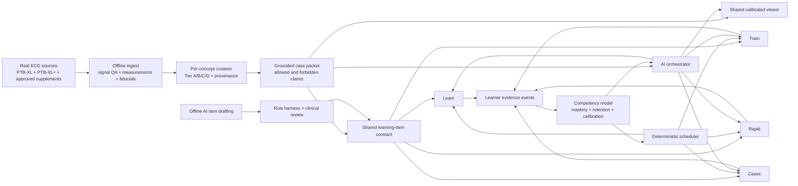

# ECG AI Learning Platform — Product Rebuild 2026

**Status:** implementation evaluation and target architecture  
**Date:** July 9, 2026  
**Audience:** product, engineering, medical education, and clinical reviewers

> **Superseded July 9 evaluation.** This file preserves the diagnosis and target architecture that drove the rebuild; statements about the then-current thin Training/Rapid modes, synthetic Clinical fixtures, bank size, mastery model, and missing coverage are historical. Current implementation and release gates are in `docs/MODES_2_4_RELEASE_READINESS.md`; current storage/API contracts are in `docs/DATA_SCHEMA.md`.

> **Educational use only.** This platform is not a diagnostic device, clinical decision-support system, or substitute for supervised medical training.

## 1. Executive verdict

The repository did not begin as worthless code. It contained several unusually valuable pieces: a full PTB-XL/PTB-XL+ ingestion path, conservative concept-level curation, a grounded case-packet contract, a capable interactive viewer, and a carefully iterated Foundations storyboard. The product nevertheless felt weak because those pieces were fragmented across a generic dashboard, overlapping practice routes, a standalone Foundations prototype, thin tutorial content, and a Clinical Decisions experiment that could still serve synthetic fixtures and unreviewed generated content.

This rebuild establishes a coherent four-mode product shell and materially improves the learning workflows:

1. **Learn** — guided, interactive tutorial pathways.
2. **Train** — deliberate practice on one competency with nearby mimics.
3. **Rapid** — full ECG interpretation under configurable time pressure.
4. **Cases** — ECG-informed clinical decision drills.

The rebuild also brings the viewer closer to a real diagnostic printout: a sequential 3 × 4 12-lead layout, a full-width lead-II rhythm strip, calibrated paper, real waveform data, median beats, point/interval/region interactions, and structured AI viewer actions.

It is now a credible functional V1 foundation. It is **not yet a comprehensive or clinically release-ready learning product**. The most important remaining limitations are:

- Modules 2–9 now have authored native scene sequences, but only Foundations has the full density of bespoke animations and manipulatives intended for the final product;
- the shared mastery model is still a simple per-objective additive score;
- the real generated Clinical Decisions bank is small and currently MCQ-only;
- several visually diverse Clinical Decisions tasks still depend on synthetic fixture waveforms;
- the clinical acuity, symptom-causality, and required-action tables have not received formal clinician sign-off;
- PTB-XL is a chronic/resting dataset and cannot honestly provide broad acute-care, telemetry-event, or serial-ECG practice;
- the live conversational path is verified with GPT-5.5, but a public/account-enabled API alias for “GPT 5.6 Luna” has not been established;
- the final combined rebuild still needs a clean full verification run, browser QA, accessibility review, and medical-content review.

The central product decision should be to preserve the strong deterministic data and viewer foundation while rebuilding curriculum depth, competency evidence, and clinical-content governance around it.

## 2. Evidence reviewed

This evaluation consolidates the product intent and current implementation from:

- [`../ECG_PLATFORM_SPEC.md`](../ECG_PLATFORM_SPEC.md) — canonical V1 data, viewer, curation, tutoring, practice, and mastery requirements.
- [`storyboard-foundations.md`](storyboard-foundations.md) — the 13-scene Foundations pedagogy and interaction model.
- [`storyboards/CURRICULUM_ARCHITECTURE_RECOMMENDATION.md`](storyboards/CURRICULUM_ARCHITECTURE_RECOMMENDATION.md) and the `VERBATIM_M01_M10` storyboard set — the source-audited ten-module architecture, literal scene copy, cross-mode handoffs, and exact AI tangent/return contract.
- [`../foundations/MODULE_GUIDE.md`](../foundations/MODULE_GUIDE.md) and [`../foundations/MODULE_TEXT.md`](../foundations/MODULE_TEXT.md) — the actual Foundations prototype, grader, tutor guardrails, and known gaps.
- [`storyboard-clinical-case.md`](storyboard-clinical-case.md) — Clinical Decisions design, scoring, timing, evidence, and provenance requirements.
- [`clinical-generation-review.md`](clinical-generation-review.md), [`clinical-decisions-review-round2.md`](clinical-decisions-review-round2.md), and [`clinical-decisions-review-round3.md`](clinical-decisions-review-round3.md) — documented generation and grading failure modes.
- [`AUTONOMOUS_CURATION.md`](AUTONOMOUS_CURATION.md), [`AI_GROUNDING_AND_SAFETY.md`](AI_GROUNDING_AND_SAFETY.md), [`DATA_SCHEMA.md`](DATA_SCHEMA.md), and [`ECG_VIEWER_COORDINATE_SYSTEM.md`](ECG_VIEWER_COORDINATE_SYSTEM.md) — supporting contracts.
- The current frontend routes, backend APIs, storage, grading, clinical harness, viewer, and corpus manifests.

The current full corpus manifest reports **21,799 records**, of which **21,157 are Tier A/B student-facing cases**. That is a large recording corpus, but it is not equivalent to 21,157 trustworthy examples for every objective.

## 3. Product definition: four modes, one learning system

The four modes must remain distinct. Turning every screen into a tutor chat or every activity into an MCQ would erase the reason for having modes at all. They should instead share a learner model, case-packet contract, viewer, item schema, and event stream.

| Mode | Primary learning purpose | AI stance | Core activity | Evidence written to mastery |
| --- | --- | --- | --- | --- |
| **1. Learn** | Build concepts and a repeatable interpretation framework | Visible co-pilot; asks Socratic questions, demonstrates, answers tangents, and returns to the lesson | Animated explanation → manipulation → guided attempt → independent transfer | Concept check, measurement/click accuracy, hints, explanation quality, independent transfer |
| **2. Train** | Make one visual or measurement competency reliable | Quiet coach; supplies a bounded hint, visual highlight, contrast explanation, and remediation | Target-heavy contrast sets with normal and nearby mimics | Target classification, evidence cited, ROI/measurement error, confidence, hint dependence, retention |
| **3. Rapid** | Perform a complete ECG read efficiently | Silent until commitment; concise debrief afterward | Blinded 12-lead, structured sweep, synthesis, confidence, timed or untimed | Component accuracy, critical misses, overcalls, response time, confidence calibration |
| **4. Cases** | Use ECG evidence within a defensible clinical decision | Silent during the decision; attending-style reason-me-back afterward | Situation-framed decision, triage, comparison, click proof, audit, or stepwise disposition | Recognition, acuity calibration, action safety, comparison validity, confidence, timing |

### 3.1 Mode 1 — Learn

The target tutorial architecture is not “static slides plus a chat box.” Each lesson should be a state machine whose tutor knows:

- the current objective and prerequisites;
- what has already been taught;
- which real or simulated tracing is on screen;
- the learner's answer and interaction history;
- the current viewer state;
- which explanation, hint, and viewer actions are allowed;
- where to resume after a tangent.

The strongest existing pattern is the Foundations progression:

- dependency-forced sequencing;
- normal before abnormal;
- describe before diagnose;
- box counting and printed measurements before optional calipers;
- modeled → guided → independent release;
- visual reason-me-back rather than a red X;
- “not assessable” as a valid answer when the tracing does not support a claim;
- a summonable normal-values card, glossary, test-out, and resume.

Every later pathology module should reach this level of specificity. A short generic tutorial route is not a substitute for authored, interactive teaching.

### 3.2 Mode 2 — Train

Competency training should isolate a skill without reducing it to memorizing the name of the selected deck. A session should therefore interleave:

- mostly the selected target;
- closely related mimics;
- normal controls;
- borderline or noisy cases when the objective supports them;
- a transfer case after performance stabilizes.

Task types should expand beyond classification to include:

- identify the relevant lead;
- click a point, interval, segment, lead panel, or territory;
- draw a bounding box;
- measure with boxes or calipers;
- compare with normal;
- distinguish two look-alikes;
- state the visual discriminator;
- connect a finding to its clinical implication after recognition is secure.

### 3.3 Mode 3 — Rapid

Rapid practice should assess a complete read, not just a disease label. The default clerkship framework is:

1. Rate
2. Rhythm
3. Axis
4. Intervals
5. QRS/conduction and morphology
6. ST-T/ischemia
7. Chambers when supported
8. Synthesis

HEARTS can remain an alternate organizational framework. Timed variants should reflect the construct being tested: untimed practice for method formation, a ward pace for routine fluency, and a short emergency first-look for the most important finding. The tutor should remain silent until commitment unless the learner explicitly enters a coached variant.

### 3.4 Mode 4 — Cases

Clinical Decisions is best described as **ECG-informed clinical decision drills**, not a patient simulator. Each item needs three separate evidence layers:

1. **ECG supports** — findings on the recording, backed by the case packet.
2. **Context adds** — authored age, setting, symptoms, vitals, medications, or prior information.
3. **Action rationale** — why an answer is ideal, acceptable, safely cautious, insufficient, under-triage, or unsafe.

These layers must never be silently merged. The clinical stem is authored; it did not occur with the person whose ECG appears in PTB-XL. The UI must say so plainly.

Question-specific scoring is required:

- MCQ, triage, and disposition: recognition/threshold, acuity calibration, and action safety.
- Click tasks: concept, lead, endpoint/region geometry, and measurement precision.
- Old-versus-new: comparison validity plus the underlying ECG finding.
- Spot-the-error: identify the wrong statement and click the waveform evidence.
- Stepwise cases: credit reasoning components without forcing a fluent learner through every scaffold.

## 4. Target architecture



### 4.1 Shared contracts

The platform should have one versioned contract for each of the following:

- **Concept ontology:** stable identifiers and prerequisite relationships.
- **Case packet:** waveform provenance, measurements, statements, neutral fiducials, signal quality, concept confidence, supported/unsupported objectives, allowed/forbidden claims.
- **Learning item:** objective, task type, prompt, display requirements, answer/rubric, target geometry, difficulty, provenance, and review status.
- **Viewer action:** schema-validated zoom, lead highlight, ROI, circle, caliper, fiducial, and reset.
- **Learner event:** what the learner did and under which conditions.
- **Tutor response:** grounded message, feedback, viewer actions, citations, uncertainty, misconception tags, and next step.

### 4.2 Shared learner event

A useful learner event should minimally record:

```text
learner_id
objective_id
subskill_id
task_type
case_id
recording_source
reliability_tier
morphology_or_difficulty_cluster
response
correctness_or_partial_credit
click_or_measurement_error
confidence
hints_used
scaffold_level
response_time
mode_and_context
timestamp
```

This allows the platform to distinguish “recognizes RBBB in a familiar untimed example” from “independently distinguishes RBBB from LBBB and IVCD under a ward clock after two weeks.” Both currently risk collapsing into one scalar.

## 5. Shared competency model

### 5.1 What is implemented now

The backend already stores:

- mastery from 0 to 1 per objective;
- attempts and correct responses;
- high-confidence wrong responses;
- last-practiced timestamps;
- recent attempts and misconception tags;
- hint-sensitive mastery deltas;
- adaptive selection based on low mastery, staleness, high-confidence errors, and recent-case avoidance.

Clinical shifts reuse the same mastery store and add calibration events. Focused concept practice now grades only the requested competency rather than penalizing the learner for omitting incidental labels on a multi-label ECG.

### 5.2 What the target model needs

The current additive rule is appropriate for a transparent prototype, but it should not be treated as a validated mastery estimate. The next model should:

- weight independent answers more than hinted answers;
- treat high-confidence wrong answers as stronger evidence of a misconception;
- separate recognition, localization, measurement, interpretation, and action;
- model retention through delayed retrieval rather than only recent accuracy;
- require performance across multiple morphology clusters and recordings;
- prevent repeated near-duplicate cases from inflating mastery;
- distinguish acquisition from transfer under time pressure and clinical context;
- carry uncertainty when too little evidence exists;
- expose why a case was selected in learner-friendly language.

The scheduler should remain deterministic and auditable. The AI may explain the recommendation and tailor its teaching response, but it should not directly assign mastery or override the scheduler's evidence rules.

## 6. AI-first orchestration and hard boundaries

“AI-first” should mean that the model coordinates teaching—not that it invents clinical truth.

### 6.1 Appropriate AI responsibilities

The conversational model may:

- explain a concept at the learner's level;
- ask a Socratic question;
- follow a tangent and return to the lesson state;
- choose among approved explanation strategies;
- compare the learner's reasoning with a grounded rubric;
- produce concise semantic feedback;
- select validated viewer actions;
- summarize misconceptions and recommend the next approved activity;
- draft offline item text that will undergo deterministic and clinical review.

### 6.2 Prohibited AI responsibilities

The model may not be the source of truth for:

- diagnoses or diagnostic labels;
- rate, axis, PR, QRS, QT, QTc, voltage, or ST measurements;
- fiducials, waveform-component locations, or ROI coordinates;
- signal quality;
- reliability tiers;
- clinical acuity, required safety actions, or answer keys;
- mastery scores;
- whether an authored vignette actually occurred with a recorded patient.

These must come from the waveform, structured datasets, deterministic calculations, approved content tables, and reviewed item manifests.

### 6.3 Model configuration

The user-authorized conversational model is **GPT-5.6 Luna** (`gpt-5.6-luna`) through the OpenAI-compatible provider abstraction. Current official model documentation lists Chat Completions, structured outputs, and tool support for Luna, while GPT-5.6 remains limited to eligible preview accounts. The model stays environment-configurable, and provider denial or invalid JSON falls back to grounded deterministic guidance without granting the model diagnostic authority.

Before enabling a live model in a student pilot:

- pin the exact model and prompt versions;
- validate every response against the structured schema;
- test claim-check false negatives and false positives;
- log cited evidence and discarded viewer actions;
- run a fixed evaluation set covering unsupported measurements, diagnoses, tangents, ambiguity, and safety deflections;
- preserve the deterministic mock for tests and offline demonstration.

### 6.4 Mode-specific tutor behavior

- **Learn:** proactive co-pilot, one useful question at a time, tangent and return.
- **Train:** one bounded nudge before commitment; detailed comparison after commitment.
- **Rapid:** silent until submission, unless the learner explicitly chooses coached practice.
- **Cases:** silent during the clinical decision; attending-style challenge and explanation afterward.

## 7. ECG realism requirements

Assessment ECGs must be recordings, not AI-generated pictures or idealized shapes. Synthetic waveforms remain useful for animations and manipulable demonstrations only when clearly labeled.

### 7.1 Required display behavior

- Standard sequential 12-lead print layout:
  - I, aVR, V1, V4
  - II, aVL, V2, V5
  - III, aVF, V3, V6
  - full-width lead-II rhythm strip
- 25 mm/s paper speed and 10 mm/mV gain by default.
- Small grid: 0.04 seconds × 0.1 mV.
- Large grid: 0.2 seconds × 0.5 mV.
- Square paper boxes at every supported viewport and zoom level.
- Calibration pulse and visible scale state.
- Correct time ownership for each sequential column and the rhythm strip.
- Lead labels, clipping, baselines, and amplitude scaling that do not distort morphology.
- Full-resolution waveform retrieval sufficient for the task.

### 7.2 Required interactions

- zoom, pan, reset;
- lead highlighting;
- point selection mapped to lead/time/amplitude;
- drag-to-annotate bounding boxes;
- time and amplitude calipers;
- interval, segment, point, lead-panel, and territory targets;
- median-beat toggle where available;
- structured AI overlays;
- hover or explicit reveal of ROI labels after commitment;
- mobile-safe zoom/confirm behavior and keyboard/tap alternatives to drag interactions.

### 7.3 Current implementation assessment

The rebuilt viewer now implements the standard sequential layout with the full lead-II strip, calibrated square grid, calibration pulse, median-beat view, zoom/pan/reset, coordinates, user ROIs, click grading, and structured overlays. This is a significant improvement over rendering every lead as an independent 10-second panel.

Remaining realism work includes:

- visual-regression testing against known reference printouts;
- explicit support and labeling for alternative speeds/gains when introduced;
- task-dependent use of 500 Hz data for fine fiducial or morphology work rather than always relying on the 100 Hz corpus representation;
- filter and artifact teaching, including how acquisition settings change appearance;
- lead-reversal and lead-placement examples from trustworthy sources;
- print/export QA;
- mobile and accessibility testing;
- a production rule that synthetic clinical fixtures can never masquerade as recordings.

## 8. Corpus strategy

### 8.1 Current corpus

The current build uses PTB-XL for 12-lead recordings, labels, reports, folds, and metadata, and PTB-XL+ for measurements, independent statements, fiducials, median beats, voltage/ST features, and morphology support.

The full manifest reports:

| Measure or concept | Tier A/B cases |
| --- | ---: |
| Student-facing total | 21,157 |
| Rate / QT interval | 21,157 |
| Sinus rhythm | 19,152 |
| Normal ECG | 5,491 |
| Myocardial infarction | 4,654 |
| Left ventricular hypertrophy | 2,701 |
| First-degree AV block | 2,050 |
| QTc prolongation | 1,898 |
| Right bundle branch block | 1,462 |
| Atrial fibrillation | 1,459 |
| Left bundle branch block | 1,275 |
| ST depression | 988 |
| Supraventricular tachycardia | 367 |
| Atrial flutter | 121 |
| Posterior MI | 70 |
| Mobitz II | 30 |
| ST elevation | 28 |
| Third-degree AV block | 20 |
| Mobitz I | 1 |

This distribution matters more than the headline total. Sparse concepts cannot support near-infinite varied training, defensible mastery estimates, or safe clinical-case generation.

### 8.2 Reliability strategy

Every recording must retain a per-concept tier and evidence trail. A case may be excellent for RBBB but unusable for infarct localization. Student-facing selection should require:

- acceptable signal quality;
- concept-specific Tier A/B confidence;
- concordance between independent sources where the concept requires it;
- measurements or morphology support appropriate to the claim;
- lead/territory evidence for lead-specific teaching;
- a minimum number and diversity of cases before a competency is enabled.

Neutral fiducial ROIs locate components such as a QRS or ST segment. Their presence is not diagnostic evidence.

### 8.3 “Near-infinite” practice without fake data

The practical path to abundant practice is combinatorial, not synthetic waveform generation:

- many real recordings per concept;
- morphology and difficulty clustering;
- different task types on the same recording;
- different accepted leads or regions;
- normal/mimic/target contrast sets;
- measurement, recognition, localization, synthesis, and clinical-transfer tasks;
- delayed reuse after spacing, with near-duplicate controls;
- multiple authored contexts only when each context is compatible with the recording and clearly disclosed.

No single ECG should be counted as many independent mastery observations merely because it was shown through several prompt variants.

### 8.4 Supplemental datasets

PTB-XL is predominantly chronic/resting. It cannot honestly cover:

- broad acute STEMI evolution;
- VT/VF/arrest rhythms;
- transient torsades or pauses;
- telemetry alarms;
- hyperkalemia with linked laboratory confirmation;
- true old-versus-new comparison;
- dynamic serial response to treatment.

The design documents identify STAFF-III as a candidate for acute ischemia and dynamic ST-change, but not as a VT/code source. They also note that useful MIMIC-IV-ECG label linkages may be credentialed or DUA-restricted. These license and provenance claims must be independently verified before product ingestion.

The target corpus program should separately source and validate:

- acute/serial ischemia;
- paired prior/current ECGs;
- telemetry and rhythm strips;
- ventricular arrhythmias and resuscitation rhythms;
- electrolyte-linked cases;
- pediatric and congenital patterns where intended;
- broader demographic, device, and acquisition diversity.

## 9. Real recordings versus authored context

This distinction must be visible in the data model and learner UI.

### 9.1 Real-record item

- **Waveform:** a de-identified recording from an identified dataset.
- **Measurements/fiducials:** dataset-provided or deterministic derivatives with source metadata.
- **ECG findings:** confidence-gated case-packet claims.
- **Clinical context:** authored board-style context designed to exercise a decision; not linked to the recorded patient.
- **Action rationale:** an educational rubric that requires review; not a claim about actual care delivered.

Recommended learner-facing provenance:

> Real, de-identified teaching ECG. The clinical context is authored to practice a decision this ECG finding can reasonably trigger.

### 9.2 Simulated item

- **Waveform:** synthetic or parameterized.
- **Measurements and labels:** authored fixtures.
- **Permitted use:** animation, UI verification, clearly labeled demonstration, or internal testing.
- **Prohibited use:** default assessment, corpus statistics, claims of real-world variation, or a “real tracing” badge.

Recommended learner-facing provenance:

> Simulated teaching waveform. Not a patient recording and not included in mastery or clinical validation.

### 9.3 Meaning of “vetted”

`harness_pass` should mean the item passed automated structural and grounding checks. `vetted` should be reserved for a documented review state with reviewer identity/version, or renamed if no clinician reviewed it. Automated checks cannot determine that the ideal management action is truly ideal, that a distractor teaches a safe habit, or that a vignette creates a correct illness script.

## 10. What is implemented in this rebuild

### 10.1 Coherent shell and navigation

- The dashboard presents the four modes as distinct learning activities.
- The next-step panel reads learner mastery and links to focused training or mixed practice.
- Dataset and tutor status are visible.
- Navigation and visual language are consistent across the rebuilt routes.

### 10.2 Learn

- `/learn` presents a ten-module, dependency-driven curriculum map backed by the curriculum endpoint.
- Lessons expose objective labels, reliable-case counts, availability, prerequisites, and learner mastery.
- The 13-scene Foundations prototype is reachable through `/learn/foundations` with progress/resume synchronization.
- Modules 2–9 use a native 65-scene guided shell with prerequisite retrieval, first-principles why-chains, real-trace work, misconception-aware checkpoints, clinical bridges, exact tutor waypoints, and Train/Rapid/Cases handoffs.

**Current limitation:** Foundations remains embedded as a standalone iframe and is based on a 22-case teaching slice. The later modules now have a complete content sequence and functional common interaction grammar, but their current completion check is still a single three-option knowledge item; the real ECG can be incidental to passing. Bespoke action renderers, scene-specific case/geometry contracts, equivalent transfer, formal clinical review, accessibility validation, and real-learner timing evidence are required before this can support competency claims.

### 10.3 Train

- `/train` loads concept families and chooses a high-yield available default.
- The learner can select a target competency.
- Target-heavy practice interleaves sibling mimics so the selected deck does not guarantee the answer.
- Cases come from the adaptive selector and arrive with diagnosis-bearing fields blinded.
- The learner commits a classification, rationale, confidence, and hint use.
- A bounded visual hint uses neutral grounded ROIs or relevant leads.
- The full case packet, independent evidence, confidence, teaching points, and tutor become available only after commitment.
- Focused grading updates only the trained objective.

**Current limitation:** the mode is primarily a classification contrast drill. It still needs measurement, ROI, comparison, lead-selection, and multi-step competency templates.

### 10.4 Rapid

- `/rapid` supports ward pace, emergency quick-look, and untimed practice.
- Sessions contain five or ten blinded real-case selections.
- The learner records recognition tags, a compact systematic sweep, synthesis, and confidence.
- The timer starts after the waveform renders, not during network/layout time.
- Feedback reveals correct, missed, and overcalled objectives only after commitment.
- The round report summarizes score, time, and timeouts.

**Current limitation:** the recognition list and grading remain fairly coarse. Timing defaults are pilot values, and the round debrief does not yet provide a rich misconception-specific adaptive prescription.

### 10.5 Cases / Clinical Decisions

- `/practice` now enters the native Clinical Decisions workflow.
- Learn and timed Shift variants, clinic/ward/ED lanes, and short session lengths are available.
- The backend supports per-type grading, evidence manifests, acuity caps, required safety actions, symptom-causality checks, transient-event checks, display checks, calibration, and mastery updates.
- The viewer supports full 12-lead, pinned strip, stacked comparison, click, and spot-the-error displays where the item requests them.
- The local bank currently combines a small generated real-record bank with a small fixture-backed interaction bank.

**Current limitations:**

- The persisted real-record generated bank contains 15 items and they are all MCQs.
- The more varied click, old/new, spot-error, and triage examples are supplied by synthetic fixtures.
- The UI can still make a broad “real tracings” statement even when a fixture item is selected; the provenance badge is not sufficient to cancel that overclaim.
- An old/new fixture compares the same synthetic ECG with itself, which verifies the interaction but does not validate the clinical learning construct.
- Current content-table comments explicitly say the clinical knowledge defaults are not formally clinician-reviewed.
- Automated `vetted` status is not equivalent to clinical sign-off.
- Generated item quality remains vulnerable to plausible but clinically awkward stems, answer-class errors, and distractors that pass the harness.

### 10.6 Shared data, viewer, tutor, and storage

- Complete PTB-XL/PTB-XL+ corpus build and manifest gating.
- Per-concept autonomous curation and Tier A/B exclusion rules.
- Blinded pre-submission packets and full post-submission reveal.
- Standard calibrated 12-lead viewer with long lead-II strip.
- Multi-turn tutor threads, structured responses, claim checks, and safe viewer actions.
- Learner profiles, auth, attempts, mastery, misconceptions, adaptive review, and clinical calibration storage.
- Mock and OpenAI-compatible provider paths.
- Backend unit tests, coordinate tests, frontend type checking/build scripts, and Playwright specs.

**Verification caution:** existing tests cover substantial infrastructure, but the newly rebuilt `/learn`, `/train`, `/rapid`, and combined Clinical Decisions journeys need explicit final end-to-end coverage. This document does not certify that the final combined worktree has passed every verification command.

## 11. Candid implementation risks

### 11.1 Clinical truth is the highest-risk gap

The clinical harness is valuable, but it cannot establish best management on its own. Current generated examples have already shown subtle problems such as inconsistent answer classes, threshold claims, concept/ROI mismatch, and clinical stems that combine labels awkwardly. The current bank should be treated as a development bank until reviewed.

### 11.2 AI integration is uneven

Tutor grounding and viewer tools are real. Native guided scenes now send module, scene, attempt, selected point, and exact paused waypoint context, and they preserve an explicit return control after a tangent. Dynamic tutorial assembly, teaching-strategy selection, and longitudinal orchestration remain limited; Foundations still has a thinner iframe bridge, and the default local provider is deterministic mock output.

### 11.3 Corpus breadth is uneven

High-volume concepts can support meaningful variation. Mobitz I remains effectively absent, while Mobitz II, complete block, ST elevation, and posterior MI have only small pools; acute arrhythmias and serial comparisons are not supplied by the chronic corpus. The UI must not imply identical depth across all concept families.

### 11.4 Mastery is useful but not validated

The current mastery number is a transparent scheduling heuristic. It should not be described as a validated estimate of clinical competence until task dimensions, retention, case diversity, and external assessment have been studied.

### 11.5 Documentation and build artifacts have drifted

Some older documents describe only three modes or outdated fiducial-lead limitations. The full manifest currently reports all 12 fiducial leads, while older README text describes only II/V2/V5. Product claims should be generated from or checked against the active manifest and code.

## 12. Prioritized roadmap

### P0 — required before a medical-student pilot

1. **Make provenance impossible to misunderstand.**
   - Exclude synthetic fixture items from the default production bank.
   - Replace every unconditional “real tracing” statement with source-aware copy.
   - Carry recording source and authored-context status through every item and attempt.
   - Do not include fixture attempts in mastery or product corpus counts.

2. **Establish clinical-content governance.**
   - Obtain clinician review and versioned sign-off for acuity caps, symptom-causality rules, and required safety actions.
   - Review every pilot Clinical Decisions item, answer class, rationale, and distractor.
   - Separate `harness_pass` from clinician-reviewed status.
   - Build a rejection and revision workflow with an audit trail.

3. **Validate the generator and grader against a gold set.**
   - Create adversarial items for acute-language leakage, false territory, threshold errors, action-urgency overreach, transient events, and compound options.
   - Estimate harness false-negative and false-positive rates.
   - Add regression examples from the documented generation-review failures.
   - Require the grader to explain its evidence binding.

4. **Unify learner evidence across all modes.**
   - Store task type, scaffold, timing, click/measurement error, case diversity, and provenance.
   - Prevent fixture and repeated-case evidence from inflating mastery.
   - Ensure Clinical Decisions, Foundations, Train, and Rapid all update the same objective/subskill graph correctly.

5. **Finish the AI production contract.**
   - Verify GPT 5.6 Luna availability through the deployment account.
   - Pin model and prompt versions.
   - Run structured-output, grounding, viewer-action, tangent, and safety evaluations.
   - Preserve a deterministic fallback.

6. **Complete final engineering verification.**
   - Run the full backend suite, coordinate tests, typecheck, production build, and corpus-pinned smoke flow.
   - Add Playwright coverage for all four rebuilt routes, blinding/reveal, hint use, timing, and source badges.
   - Add visual-regression checks for the standard ECG print layout.

7. **Run an accessibility and mobile gate.**
   - Keyboard/tap alternatives for drag interactions.
   - Screen-reader labels and focus order.
   - Minimum target sizes, zoom behavior, and timer accommodations.
   - No timing penalty before the viewer is interactive.

8. **Synchronize documentation and product claims.**
   - Make this document and the active manifest the basis for current-state claims.
   - Update outdated README limitations and the canonical spec.
   - Remove or clearly label superseded prototypes and review packets.

### P1 — required for the comprehensive learning product

1. **Production-author every storyboard scene.**
   - The source-audited ten-module sequence and exact production storyboards now exist; complete the typed scene-data migration, clinician review, learner validation, and additional real-case variants.
   - Complete formal medical-content review, accessibility testing, timing studies, and revision with representative learners before pilot release.

2. **Expand Train into a task-template system.**
   - Classification, normal-vs-abnormal, click, lead selection, interval/segment measurement, bounding box, comparison, explanation, and clinical implication.
   - Target/mimic/normal balance controlled by mastery and morphology diversity.

3. **Improve Rapid assessment quality.**
   - Per-component semantic rubrics and critical-error weighting.
   - Better synthesis grading, confidence calibration, and adaptive debrief.
   - More nuanced pace profiles validated with learners.

4. **Build a real-record, multi-type Clinical Decisions bank.**
   - MCQ, triage, stepwise, click, prove-it, spot-the-error, and defensible insufficient-data items.
   - Source paired data before enabling old-versus-new.
   - Do not simulate acute cases with chronic tracings.

5. **Advance the competency model.**
   - Recognition/localization/measurement/interpretation/action subskills.
   - Retention and transfer estimates.
   - Case-cluster diversity and near-duplicate detection.
   - Explainable scheduling.

6. **Improve viewer realism and ergonomics.**
   - 500 Hz task path where needed.
   - Artifact/filter/lead-placement lessons.
   - Mobile lead navigation, print/export, and standardized comparison views.

7. **Ingest approved supplemental data.**
   - Acute/serial ischemia, paired ECGs, telemetry, ventricular arrhythmias, electrolyte-linked cases, and demographic/device diversity.
   - Complete license, provenance, and dataset-specific curation reviews first.

8. **Migrate Foundations into the shared application architecture.**
   - Replace iframe-only integration with shared learner events, native tutor context, viewer state, accessibility, and analytics while preserving its strongest interactions.

### P2 — scale, evidence, and institutional readiness

1. Conduct prospective learner studies comparing the four-mode sequence with conventional case-bank use.
2. Calibrate item difficulty and discrimination using real response data.
3. Add instructor-reviewed authoring, item audit, and curriculum-mapping tools.
4. Add cohort analytics without exposing hidden answer keys or patient-level data.
5. Support institution-specific curricula, localization, and accessibility preferences.
6. Move learner storage to Postgres and waveforms to an object store when deployment requires it.
7. Add mature privacy, retention, security, observability, and incident-response controls.
8. Explore advanced simulation only as a clearly labeled complement to real recordings, never as a hidden replacement.

## 13. Pilot exit criteria

The platform should not enter a medical-student pilot until all of the following are true:

- every learner-facing tracing displays correct provenance;
- synthetic fixtures are excluded from scored production practice;
- the pilot clinical bank and clinical rule tables are clinician-reviewed and versioned;
- all four modes complete a real end-to-end flow using the shared learner model;
- diagnosis-bearing evidence remains blinded until the activity contract permits reveal;
- tutor and viewer actions pass a fixed grounding/safety evaluation;
- the ECG viewer passes calibrated visual and coordinate regression tests;
- new mode flows pass automated and manual browser testing;
- keyboard, touch, and mobile workflows are usable;
- sparse concepts are locked or explicitly limited;
- the educational-only boundary is visible and consistently enforced;
- known limitations and dataset coverage are disclosed to learners and instructors.

## 14. Product standard going forward

The benchmark is not “more screens than Wave-Maven” or “a chatbot beside an ECG.” The platform should make a learner measurably better at seeing, measuring, describing, interpreting, and acting on ECG evidence across time.

That requires:

- real and diverse recordings;
- honest provenance;
- deep authored pedagogy;
- direct waveform interaction;
- adaptive but auditable practice;
- AI that teaches from evidence rather than inventing it;
- clinical content that has passed both automated and expert review;
- transfer from isolated recognition to full interpretation and clinical use.

The current rebuild is the right structural turn. The next phase should favor content truth, competency evidence, and clinical review over adding superficial modes or generating a large unreviewed item count.
