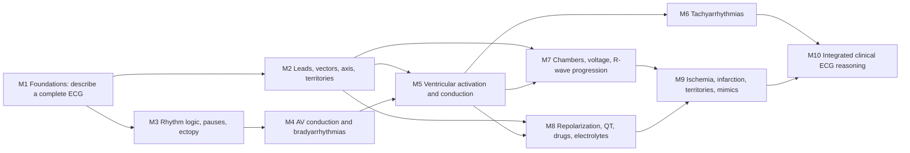

# Curriculum architecture recommendation

## Decision

Use **10 guided modules in four phases**, not nine modules by fiat. Ten is the smallest coherent structure that preserves the already validated beginner Foundations sequence, keeps the rhythm/conduction reasoning chain intact, and gives repolarization and ischemia separate conceptual space. Combining either of those pairs would create an overloaded module and encourage pattern memorization before first-principles understanding.

The authoritative content spine is `ECG_PLATFORM_SPEC.md` §11 (the sixteen-item minimum curriculum). Section 7 supplies the required concept ontology, §12 supplies the two systematic-interpretation frameworks, and §16 supplies misconception targets. The original Foundations documents provide the validated dependency order for Module 1. Clinical-case documents inform transfer and mode boundaries; they do not replace §11 as the guided-curriculum source of truth.

## Source hierarchy used for this recommendation

1. **Binding curriculum coverage:** `ECG_PLATFORM_SPEC.md` §11, with §7, §12, and §16 as required elaborations.
2. **Validated beginner sequence:** `docs/storyboard-foundations.md` and `foundations/MODULE_GUIDE.md`. Preserve their grid → waves → readability → rate/rhythm → intervals → normal ST/T → 12 leads → basic axis → modeled/guided/independent read spine.
3. **Grounding and case eligibility:** `ECG_PLATFORM_SPEC.md` §§6–9 and `docs/AUTONOMOUS_CURATION.md`. A real ECG may teach or grade only the concepts for which its case packet is eligible.
4. **Clinical transfer design:** `docs/storyboard-clinical-case.md`. Its situation, decision, timing, calibration, and reason-me-back patterns belong primarily in Clinical Decisions mode.
5. **Provisional clinical elaboration:** `docs/clinical-content-tables-review.md`. It usefully expands concepts such as fascicular blocks, pre-excitation, paced rhythms, PACs, and PVCs, but its acuity/action rows remain pending clinician sign-off and must not become authoritative management copy.

The later `docs/CURRICULUM_STORYBOARD_SYSTEM_V2.md` is an implementation artifact, not the source used to infer required coverage here.

## Dependency architecture

This is a prerequisite graph, not a demand that every learner move in a rigid line. After M5, M6 and M7 may be taken in either order. M8 requires the lead/vector and secondary-repolarization concepts from M2/M5; M9 requires M7/M8. M10 requires demonstrated competence across both the rhythm and morphology branches.

## Recommended guided modules and chapters

### Phase A — ECG literacy

### M1. Foundations: from signal to a complete descriptive read

**Purpose:** Build the visual language and the repeatable sweep without asking a novice to diagnose disease.

**Chapters:**

1. Electrical activation draws the P–QRS–T waveform.
2. Paper speed, time, voltage, calibration pulse, and signal readability/artifact.
3. Regularity and rate methods.
4. P-wave evidence and the sinus pattern.
5. PR, QRS, ST, T, QT/QTc as measured/described components with normal references.
6. Twelve simultaneous views, basic R-wave progression, and basic axis.
7. Calibration/quality → rate → rhythm → axis → intervals → QRS/morphology → ST-T → synthesis.
8. Modeled → fading-guidance → independent complete reads.

**Exit competency:** Independently produce a complete finding-language description of a readable 12-lead and explicitly say when a feature is not assessable. Do not require a named pathology.

**Architecture note:** Port the validated 13-scene Foundations spine rather than collapsing it into a generic lesson. Add keyboard/tap alternatives for every drag-only interaction before calling it production-ready.

### M2. Leads, vectors, axis, and territories

**Purpose:** Replace memorized lead lists with a spatial model that later supports axis, chamber patterns, and ischemia localization.

**Chapters:**

1. Electrode versus lead; twelve views from ten electrodes.
2. Frontal-plane limb leads and augmented leads.
3. Horizontal-plane precordial leads and anatomical placement.
4. Why a vector produces positive, negative, or isoelectric deflection.
5. Contiguous lead groups and anatomical territories, without yet diagnosing infarction.
6. Axis by I/aVF, lead-II refinement, and the hexaxial/vector method.
7. Localize a highlighted finding by selecting the leads that share it.
8. Normal variation, lead reversal/misplacement clues, and limits of localization.

**Exit competency:** Predict polarity from vector direction, determine frontal QRS axis with appropriate boundary language, and identify contiguous lead/territory groups.

### Phase B — Rhythm and conduction reasoning

### M3. Rhythm logic: sinus, irregularity, pauses, and ectopy

**Purpose:** Teach learners to build separate atrial and ventricular timelines before attaching rhythm labels.

**Chapters:**

1. A rhythm-strip workflow: atrial activity, ventricular activity, regularity, relationship.
2. Marching P waves and QRS complexes; 1:1, dropped, premature, and dissociated events.
3. Sinus rhythm, sinus bradycardia, sinus tachycardia, and sinus arrhythmia.
4. Premature atrial complexes versus premature ventricular complexes.
5. Compensatory pauses, noncompensatory pauses, and artifact.
6. Organized versus disorganized atrial activity as the bridge to flutter/AF.
7. Uncertainty language when P waves or timing cannot be resolved.

**Exit competency:** Construct an evidence-based atrial/ventricular timing description and distinguish sinus variation, ectopy, pauses, and artifact without relying on rate alone.

### M4. AV conduction and bradyarrhythmias

**Purpose:** Derive AV-block patterns from timing and conduction ratios, not from visual buzzwords.

**Chapters:**

1. AV-node/His–Purkinje physiology and the PR interval.
2. First-degree AV block.
3. Wenckebach/Mobitz I through progressive timing.
4. Mobitz II through fixed conducted PR intervals and dropped QRS complexes.
5. 2:1 and advanced block: what can and cannot be named from the tracing.
6. Complete AV block, AV dissociation, atrial and ventricular rates.
7. Escape rhythms and severe bradycardia.
8. Mimics, especially blocked PACs and artifact; clinical stability/pacing connection in a guided case.

**Exit competency:** Mark P and QRS timelines, state the conduction relationship, distinguish the major AV blocks, and identify when a higher-stakes bradyarrhythmia warrants prompt clinical escalation in an educational case.

### M5. Ventricular activation, conduction delay, pre-excitation, and pacing

**Purpose:** Explain QRS width and morphology from activation sequence before learners face wide-complex tachycardia or ischemia with abnormal depolarization.

**Chapters:**

1. Normal septal-to-ventricular activation and why the QRS is narrow.
2. Duration versus morphology; V1/V6 as paired diagnostic views.
3. RBBB and incomplete RBBB.
4. LBBB.
5. Fascicular blocks, bifascicular patterns, and axis linkage.
6. Nonspecific intraventricular conduction delay.
7. Pre-excitation/WPW from short PR, delta wave, and altered activation.
8. Paced rhythms and pacing spikes/capture.
9. Expected secondary ST-T discordance and why conduction changes complicate ischemia reading.

**Exit competency:** Classify a wide QRS using duration plus lead morphology, distinguish RBBB/LBBB/IVCD when evidence supports it, and recognize pre-excitation or pacing without overcalling ischemia from secondary ST-T changes.

### M6. Tachyarrhythmias: a mechanism-first approach

**Purpose:** Reuse the atrial/ventricular clocks and QRS-conduction model to reason through tachycardia safely.

**Chapters:**

1. The stable first pass: rate, regularity, QRS width, atrial activity, AV relationship.
2. Sinus tachycardia versus regular narrow-complex SVT.
3. Atrial flutter, conduction ratios, and why it can masquerade as sinus tachycardia.
4. Atrial fibrillation and the error of looking only at rate.
5. Irregular narrow-complex differentials.
6. Regular wide-complex tachycardia and the safety-first differential.
7. Irregular wide-complex tachycardia, pre-excitation connection, and limits of novice classification.
8. Timed recognition, stability framing, and rhythm-specific clinical transfer.

**Exit competency:** Classify common tachyarrhythmias from explicit evidence, discriminate AF/flutter/SVT patterns, and treat wide-complex tachycardia as a high-stakes category without using unsupported morphology shortcuts.

### Phase C — Morphology, repolarization, and injury

### M7. Chambers, voltage, and R-wave progression

**Purpose:** Teach chamber-pattern evidence and its limitations before learners use hypertrophy/strain as an ischemia mimic.

**Chapters:**

1. Atrial enlargement patterns and why morphology matters more than a single label.
2. LVH voltage criteria, axis, and repolarization context.
3. RVH evidence across axis, V1, and precordial balance.
4. Normal R-wave progression and the transition zone revisited.
5. Poor R-wave progression: lead placement, normal variation, conduction, chamber patterns, and prior infarction as possibilities rather than automatic diagnosis.
6. Strain patterns and the bridge to secondary versus primary ST-T change.
7. Criteria limitations, age/body habitus, false positives, and evidence-weighted synthesis.

**Exit competency:** Describe supported atrial/ventricular enlargement or hypertrophy evidence, assess R-wave progression, and avoid diagnosing chamber enlargement from one weak voltage criterion.

### M8. Repolarization, QT/QTc, drugs, electrolytes, and nonischemic ST-T patterns

**Purpose:** Establish how repolarization is measured and altered before ischemia localization adds another layer of meaning.

**Chapters:**

1. J point, baseline selection, ST segment, and T-wave physiology.
2. ST elevation, ST depression, T-wave inversion, and nonspecific ST-T change as findings.
3. Primary versus secondary repolarization abnormalities, reconnecting to BBB/LVH/pacing.
4. QT measurement, difficult T-wave endings, and U-wave handling.
5. QT correction, rate dependence, formula limitations, and QT-versus-QTc errors.
6. Medication-related QT prolongation and the medication-safety workflow.
7. Electrolyte patterns only where the grounded case evidence supports them.
8. Pericarditis pattern, early-repolarization/normal-variant concepts, and uncertainty.

**Exit competency:** Measure and interpret QT/QTc in rate context, describe ST-T abnormalities, distinguish primary from expected secondary change, and use a safe drug/electrolyte review workflow without inventing an etiology.

### M9. Ischemia and infarction: localization, evolution, and mimics

**Purpose:** Combine lead geography and repolarization reasoning into evidence-based ischemia/infarction interpretation.

**Chapters:**

1. Ischemia/injury/infarction as physiology, with appropriate limits on what an ECG alone proves.
2. Contiguous leads and anterior, septal, lateral, inferior, and posterior territories.
3. ST elevation and reciprocal changes.
4. ST depression and T-wave inversion in context.
5. Pathologic Q waves, prior infarction, and old-versus-new reasoning.
6. Posterior involvement and additional-lead concepts.
7. Serial change and comparison with a prior ECG.
8. Mimics and confounders: pericarditis, LVH/strain, BBB/pacing, normal variants, and nonspecific ST-T change.
9. Chest-pain transfer case: finding → localization → differential confidence → appropriate urgency, without unsupported culprit-vessel claims.

**Exit competency:** Identify and localize supported ischemic/infarction patterns, use reciprocal/serial evidence, distinguish common mimics, and communicate uncertainty and urgency proportionately.

### Phase D — Integration and transfer

### M10. Integrated clerkship-to-clinical ECG reasoning

**Purpose:** Convert component knowledge into a reliable whole-ECG performance and hand the learner into the other three practice modes.

**Chapters:**

1. Choose and explicitly learn either the standard framework or HEARTS; map both to the same objective set.
2. Quality/calibration first, then a complete structured interpretation.
3. Synthesis: findings → prioritized ECG impression → limits/uncertainty.
4. Audit the machine interpretation while using its measurements appropriately.
5. Compare with a prior and identify meaningful change.
6. Guided transfer cases: chest pain, syncope/bradycardia, palpitations/tachycardia, medication/QTc, and resuscitation recognition where reliable data exist.
7. Present a concise one-line ECG interpretation and relevant clinical implication.
8. Independent mixed cases with tutor faded out; personalized remediation into the exact source scene and Training objective.

**Exit competency:** Complete and communicate a structured interpretation, justify the key abnormality on the waveform, calibrate confidence, connect it to the clinical context, and know what requires escalation versus further information.

## Exact §11 source-topic mapping

| `ECG_PLATFORM_SPEC.md` §11 requirement | First instruction | Mastery / later spiral | Notes |
|---|---|---|---|
| 1. ECG orientation: paper speed, calibration, amplitude, time, 12-lead layout | M1 chapters 1–2 and 6 | M10 quality-first read | Preserve explicit box values and calibration habit from Foundations. |
| 2. Lead anatomy: limb, precordial, territories, contiguous leads | M1 basic layout | M2 full spatial model; M9 use in ischemia | Territory is learned as geography before pathology. |
| 3. Rate | M1 chapter 3 | M3 rhythm context; M6 tachy; M10 mixed reads | Regularity selects the method. |
| 4. Rhythm: P waves, regularity, sinus | M1 chapters 3–4 | M3 full timing model; M4/M6 application | Rate is not part of the definition of sinus rhythm. |
| 5. PR interval | M1 chapter 5 | M4 AV conduction | Measure before assigning block. |
| 6. Axis | M1 basic quadrant | M2 full method; M5/M7 application | Lead-II boundary refinement belongs in M2. |
| 7. QRS duration and conduction delay | M1 chapter 5 | M5 full activation/conduction model | Width alone cannot establish a specific bundle block. |
| 8. Bundle branch blocks | M5 chapters 2–5 | M6 wide tachy; M8/M9 secondary ST-T/confounding | RBBB/LBBB contrast must use real morphology evidence. |
| 9. R-wave progression | M1 chapter 6 | M7 chapters 4–5 | First teach normal transition, then abnormal differential. |
| 10. Chamber enlargement/hypertrophy basics if supported | M7 | M9 mimic discrimination; M10 synthesis | Case practice remains reliability-gated. |
| 11. ST elevation/depression and T-wave changes | M1 normal reference | M8 finding/physiology; M9 ischemic use | Separating finding from cause prevents MI overcalling. |
| 12. MI localization | M2 territory prerequisite | M9 full localization | Exact lead/territory claims require lead-level evidence. |
| 13. Bradyarrhythmias and AV block | M3 timing prerequisite | M4 full module; M10 syncope case | Includes ambiguity in 2:1/advanced block. |
| 14. Tachyarrhythmias: AF/flutter, SVT, wide-complex tachycardia | M3 atrial/ventricular clocks + M5 QRS prerequisite | M6 full module; M10 palpitations/resuscitation cases | Only use reliable cases; WCT is taught with a safety-first posture. |
| 15. QT/QTc and electrolyte/drug patterns if supported | M1 QT concept | M8 full module; M10 medication case | Do not infer a drug/electrolyte cause from waveform alone. |
| 16. Integrated clerkship-style ECG interpretation | M1 finding-language sweep | M10 diagnostic/clinical synthesis; Rapid and Clinical modes | Framework may be Standard or HEARTS, but objectives are identical. |

## Ontology and misconception deltas beyond §11

| Source | Required delta | Curriculum home |
|---|---|---|
| §7 ontology | Normal ECG | M1 reference and independent read; M10 mixed-case discrimination. |
| §7 ontology | Nonspecific IV conduction delay | M5. |
| §7 ontology | Atrial enlargement, LVH, RVH | M7. |
| §7 ontology | Nonspecific ST-T change and pericarditis pattern | M8, then M9 as ischemia mimics. |
| §7 ontology | Septal and posterior MI | M9. |
| Clinical content tables | PAC/PVC, incomplete RBBB, fascicular block, WPW, pacing | M3 for PAC/PVC; M5 for the conduction/pre-excitation/pacing set. |
| §16 misconception | Flutter mistaken for sinus tachycardia | M3 timing foundation; explicit discriminator in M6. |
| §16 misconception | AF missed because learner focuses on rate | M3 rhythm workflow; explicit counterexample in M6. |
| §16 misconception | MI overcalled from nonspecific ST-T changes | M8 finding-versus-cause discipline; mixed discrimination in M9. |
| §16 misconception | ST elevation recognized but localized incorrectly / reciprocal changes ignored | M2 lead geography; M9 localization and reciprocal-evidence tasks. |
| §16 misconception | LBBB confused with RBBB / wide QRS missed | M5 contrasting V1/V6 morphology plus duration gate; revisit in M6. |
| §16 misconception | QT measured instead of QTc | M8 rate-linked compare/calculate tasks. |
| §16 misconception | Limb leads misused for axis | M2 vector lab and lead-selection tasks. |
| §16 misconception | AV block types confused | M4 march/relationship tasks, including ambiguous 2:1 cases. |
| §16 misconception | Paced rhythm or artifact mistaken for arrhythmia | M1 quality, M3 artifact, M5 pacing, M10 mixed transfer. |
| §16 misconception | Normal variants under-recognized | M1 normal reference, M7 progression/voltage limits, M8/M9 mimic sets. |

## Mode separation and cross-mode connections

The ten modules are the **Guided** mode curriculum. They should not absorb the jobs of the other modes.

| Mode | Primary job | AI posture | Valid mastery evidence |
|---|---|---|---|
| Guided modules | Construct mental models and demonstrate a method | Visible Socratic copilot; grounded highlights; tangent-and-return | Formative scene evidence, not proof of independent case competence |
| Training | Isolate and repeat one subskill until fluent | Selects cases and diagnoses misconceptions; hints only on request or after error | Repeated independent measurement, localization, classification, and comparison |
| Rapid interpretation | Test complete ECG performance under untimed/ward/emergency clocks | Silent before submission; concise grounded feedback after | Whole-read accuracy, ROI evidence, time, confidence calibration |
| Clinical Decisions | Transfer ECG interpretation into context, prioritization, and action | Silent during decision; reason-me-back after; attending persona when appropriate | Clinical synthesis/action, calibration, old-vs-new, serial updating |

Every guided-module exit should publish three links:

1. **Train this skill:** exact objective drill, e.g. M5 → “RBBB versus LBBB morphology.”
2. **Test it in a full read:** Rapid cases containing the objective among distractors and normal findings.
3. **Use it clinically:** an unlocked Clinical Decision family, e.g. M8 → medication/QTc cases.

Every error in Training, Rapid, or Clinical mode should return to the **smallest remedial scene**, not merely the module landing page. The shared mastery model should keep separate dimensions for recognition, measurement, localization, mechanism, synthesis, clinical action, and confidence calibration; tutor-assisted completion must not masquerade as independent mastery.

## Production traceability rules

To ensure the authoritative document remains mechanically visible during storyboarding and implementation, every production scene should carry:

- `sourceRefs`: one or more exact references such as `SPEC-11.8`, `SPEC-7.right_bundle_branch_block`, or `SPEC-16.rbbb_lbbb_confusion`;
- `prerequisiteObjectives` and `teachesObjectives`;
- `caseEligibility`: required concept tier, measurements, morphology/lead evidence, and allowed claims;
- `masteryEvidence`: the learner action that counts, assistance level, and scoring dimension;
- `remediationSceneId` and cross-mode destinations.

A curriculum validator should fail when a §11 requirement has no scene, a scene assesses an untaught objective, a diagnostic/lead-specific task lacks the required case evidence, or a module exit has no independent performance gate.

## Why ten modules is the better fit

- **M1 remains a coherent, already-tested novice journey** rather than being fragmented to hit a count.
- **M3 → M4 → M5 → M6 forms one reusable timing/conduction chain.** Learners can derive rhythm diagnoses rather than memorize silhouettes.
- **M8 and M9 remain separate.** First learners understand ST/T/QT and primary versus secondary repolarization; only then do they localize ischemia and distinguish mimics.
- **M7 earns its own module** because chamber criteria, R-wave progression, normal variants, and false-positive discipline are too cognitively different from bundle-branch mechanics and are required prerequisites for ischemia-mimic reasoning.
- **M10 is synthesis, not a content dump.** It integrates both frameworks and hands learners into Rapid and Clinical modes using independent performance gates.

This architecture covers every required §11 topic, every minimum §7 concept family, both §12 frameworks, and every §16 misconception while preserving a clear first-principles progression.
